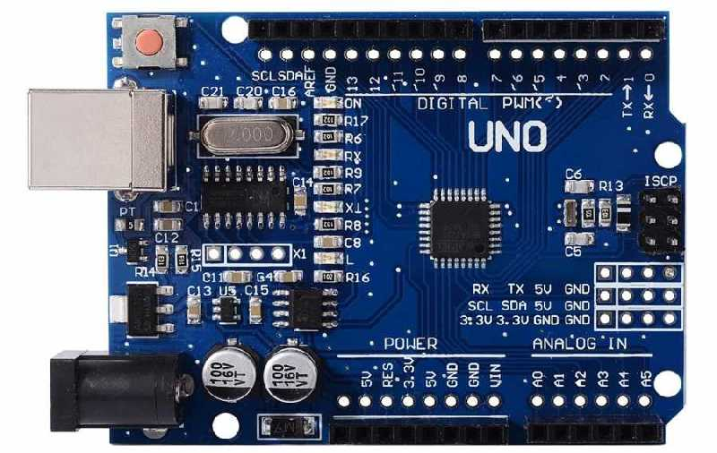

# 1.1 Arduino UNO R3

Students who take our Arduino course on-site will be given a **FREE** kit of Arduino UNO R3. Students are welcome to puchase the kit from our website at [http://www.longervisionrobot.com/en-us/products/arduino-uno-r3](http://www.longervisionrobot.com/en-us/products/arduino-uno-r3). 

Cannonical Arduino UNO R3 looks like the following image:

Two Arduino official websites about Arduino UNO R3 are recommended: 
* [https://www.arduino.cc/en/Reference/Board](https://www.arduino.cc/en/Reference/Board)
* [http://www.arduino.org/products/boards/arduino-uno](http://www.arduino.org/products/boards/arduino-uno)
