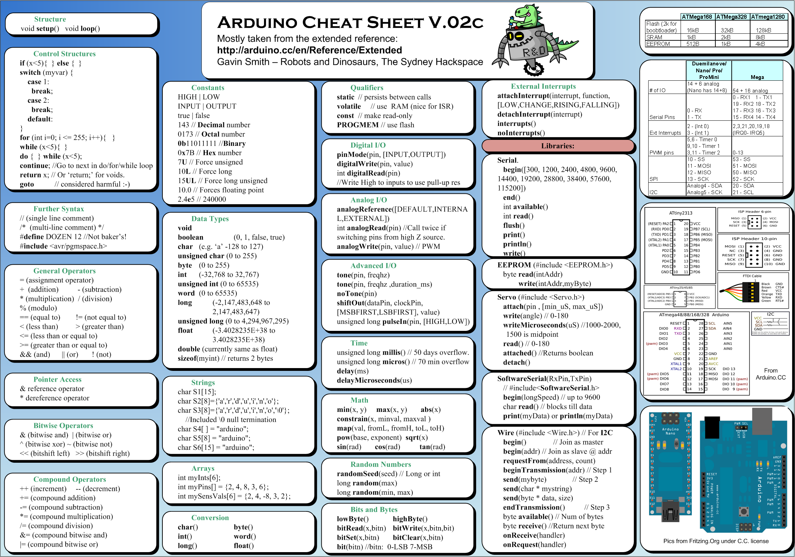
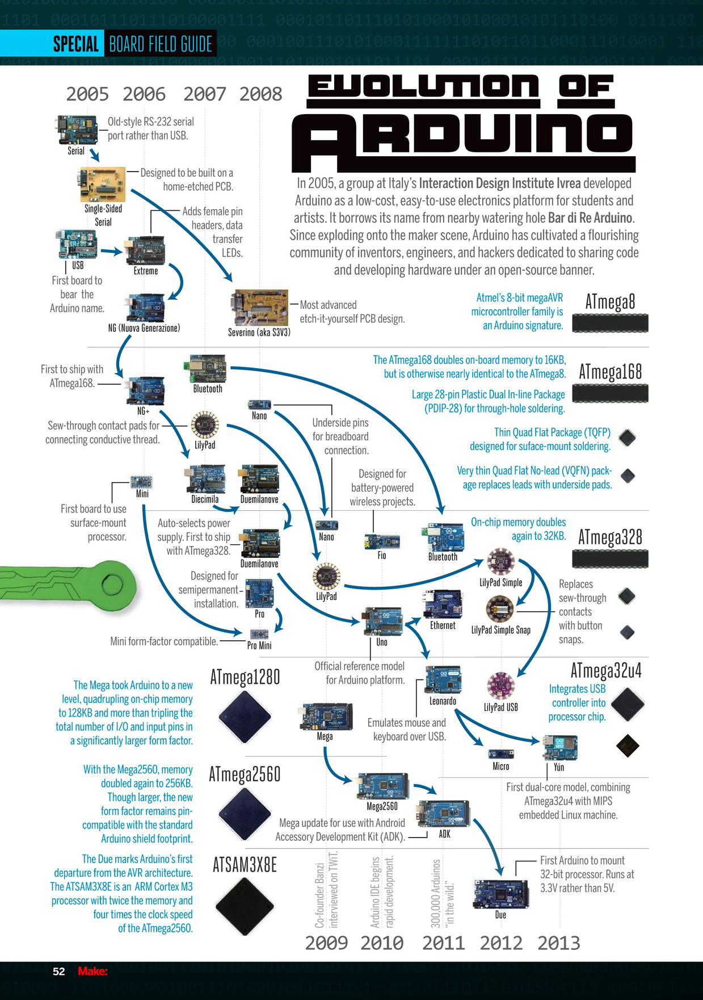

# 1.5 Arduino Online Resource

## 1.3.1 Official Websites
* [https://www.arduino.cc/](https://www.arduino.cc/)
* [http://www.arduino.org/](http://www.arduino.org/)

## 1.3.2 Third Party Open Source Code & Tutorials
* [Github - Longer Vision](https://github.com/LongerVisionRobot/Arduino/)
* [Official Tutorial](http://www.arduino.org/learning/tutorials)
* [Github - Adafruit/](https://github.com/adafruit/)
* [Github - Tech Explorations Arduino: Step by Step](https://github.com/futureshocked/arduino_sbs/)
* [Geek Workshop](http://www.geek-workshop.com/portal.php?mod=list&catid=1)

## 1.3.3 Atmel Chips' Data Sheet
* [Atmel](http://www.atmel.com/)

## 1.3.4 AVR C Compiler Resource
* [Savannah NonGNU AVR Libc](http://www.nongnu.org/avr-libc/)
* [GNU AVR-GCC](https://gcc.gnu.org/wiki/avr-gcc)

## 1.3.5 Popular Tools
* [Savannah NonGNU AVRDUDE](http://www.nongnu.org/avrdude/)
* [Savannah NonGNU Simulavr](http://savannah.nongnu.org/projects/simulavr/)
* [AVaRICE](http://avarice.sourceforge.net/)

## 1.3.6 Official Forums
* [https://forum.arduino.cc/](https://forum.arduino.cc/)
* [http://www.arduino.org/forums](http://www.arduino.org/forums)

## 1.3.7 Popular Ecosystem Forums
* [circuito.io](https://www.circuito.io/)
* [Adafruit](https://forums.adafruit.com/viewforum.php?f=37)
* [Sparkfun](https://forum.sparkfun.com/viewforum.php?f=32)
* [AVRfreaks](http://www.avrfreaks.net/)
* [reddit](https://www.reddit.com/r/arduino/)
* [geek-workshop](http://www.geek-workshop.com/portal.php?mod=list&catid=1)

## 1.3.8 Arduino Cheat Sheet
The following Arduino Cheat Sheet is cited from [http://robodino.org/resources/arduino](http://robodino.org/resources/arduino).

## 1.3.9 Evolution Tree for Arduino
The following Evolution Tree for Arduino is cited from
[http://imgur.com/yGRLPvL](http://imgur.com/yGRLPvL).

