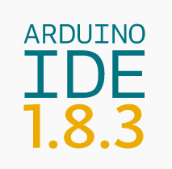
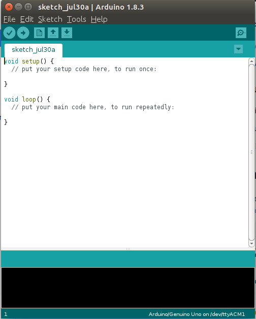

# 1.6 Arduino IDE for Prototyping

The most recent Arduino IDE can be downloaded from [http://www.arduino.org/downloads](http://www.arduino.org/downloads). The version that we are using when writing **Arduino Full Stack** is 1.8.3. 

Default Arduino sketch looks like the following:

When Arduino board is connected to the host computer via USB cable, you will be able to see **Arduino/Genuino Uno** is automatically ticked and selected under the menu **Tools->Board**. And the users have to manually select/tick the port, here in my case is: **Tools->Port->/dev/ttyACM0(Arduino/Genuino Uno)**.

Here, **ttyACM0** is a USB communication **device** (CDC) of sub-type "**abstract control model**" (**ACM**). In UNIX, **tty** is any device that acts like a "**teletype**", ie, **terminal**.
