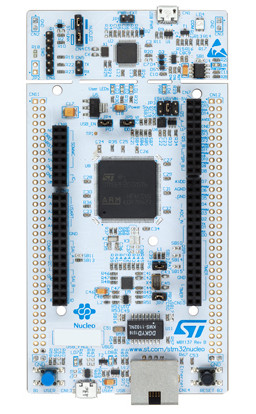

 # 1.2 STM32 Nucleo-144 Development Board with STM32F767ZI

According to ST's official website [http://www.st.com/en/evaluation-tools/nucleo-f767zi.html](http://www.st.com/en/evaluation-tools/nucleo-f767zi.html),

> The STM32 Nucleo-144 boards provide an affordable and flexible way for users to try out new concepts and build prototypes by choosing from the various combinations of performance and power consumption features, provided by the STM32 microcontroller. For the compatible boards, the SMPS significantly reduces power consumption in Run mode.

> The ST Zio connector, which extends the Arduino™ Uno V3 connectivity, and the ST morpho headers provide an easy means of expanding the functionality of the Nucleo open development platform with a wide choice of specialized shields.

> The STM32 Nucleo-144 board does not require any separate probe as it integrates the ST-LINK/V2-1 debugger/programmer.

> The STM32 Nucleo-144 board comes with the STM32 comprehensive free software libraries and examples available with the STM32Cube MCU Package.

Students who take our STM32 course on-site will be given a **FREE** Nucleo-144 development board with STM32F767ZI. 
Students are welcome to puchase the kit from our website at [http://www.longervisionrobot.com/en-us/products/stm32f767zi.html](http://www.longervisionrobot.com/en-us/products/stm32f767zi.html). 

Nucleo-144 evaluation board with STM32F767ZI looks like the following image:

