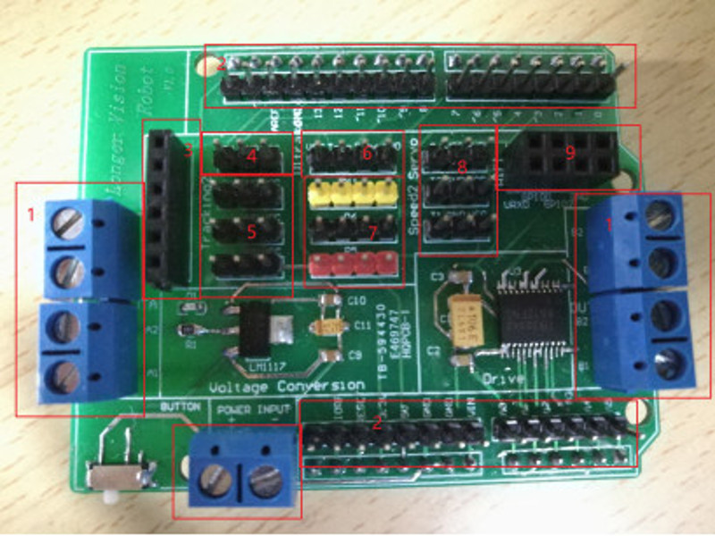

 # 1.2 STM32 Nucleo-144 Development Board with STM32F767ZI

Students who take our Arduino course on-site will be given a **FREE** proprietary Arduino exntension board designed by [Longer Vision Robot](http://www.longervisionrobot.com). Students are welcome to puchase the kit from our website at [http://www.st.com/en/evaluation-tools/nucleo-f767zi.html](http://www.st.com/en/evaluation-tools/nucleo-f767zi.html). 

The proprietary Arduino exntension board designed by [Longer Vision Robot](http://www.longervisionrobot.com) can be plugged into the Arduino UNO R3 directly, which looks like:

