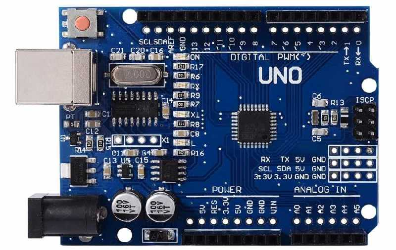

# 1.2 STM32 F767

Students who take our STM32 course on-site will be given a **FREE** STM32 development board. 

Students are welcome to puchase the kit from our website at [http://www.st.com/en/microcontrollers/stm32f767zi.html](http://www.st.com/en/microcontrollers/stm32f767zi.html). 

Cannonical Arduino UNO R3 looks like the following image:

Two Arduino official websites about Arduino UNO R3 are recommended: 
* [https://www.arduino.cc/en/Reference/Board](https://www.arduino.cc/en/Reference/Board)
* [http://www.arduino.org/products/boards/arduino-uno](http://www.arduino.org/products/boards/arduino-uno)
