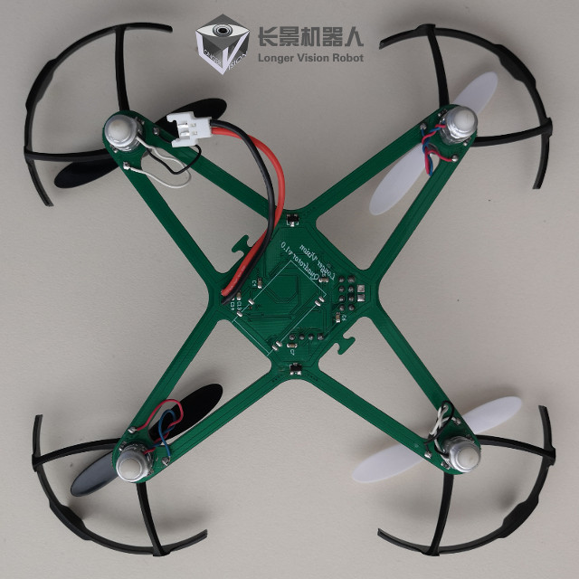
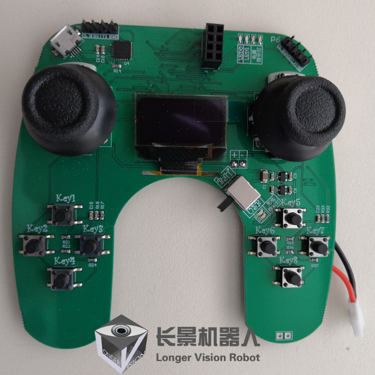
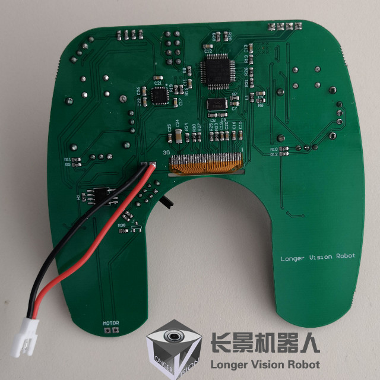
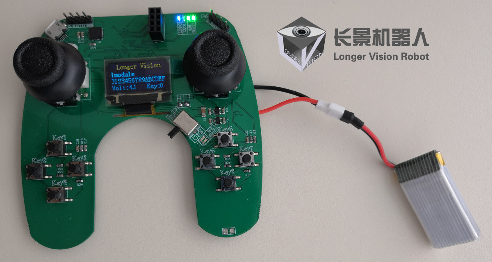

# 1.3 LVR Mini Drone

Students who take our mini drone course on-site will be given a **FREE** full set of drone with remote controller designed by [Longer Vision Robot](http://www.longervisionrobot.com). Students are welcome to puchase the kits from our website at [http://www.longervisionrobot.com/en-us/products/drone](http://www.longervisionrobot.com/en-us/products/drone).

## 1.3.1 Mini Drone Board

The proprietary mini drone board designed by [Longer Vision Robot](http://www.longervisionrobot.com) is based on a [STM32F103](http://www.st.com/en/microcontrollers/stm32f103.html) chip, which looks like:

On the drone board, two very important chips are adopted:

Item | No. of Pieces | Model | Features   
------- | ------- | -------- | -------------
Communication | 
1
 | 
nRF24L01
 | 
IMU | 
1
 | 
MPU 6050
 | 6 Degrees

## 1.3.2. Drone Controller

[Longer Vision Robot](http://www.longervisionrobot.com) also provides a proprietary remote controller, which is also based on a [STM32F103](http://www.st.com/en/microcontrollers/stm32f103.html) chip. Its front and back views are respectively as follows:

We can power on the remote controller with the provided battery and have a look at its front view again:

