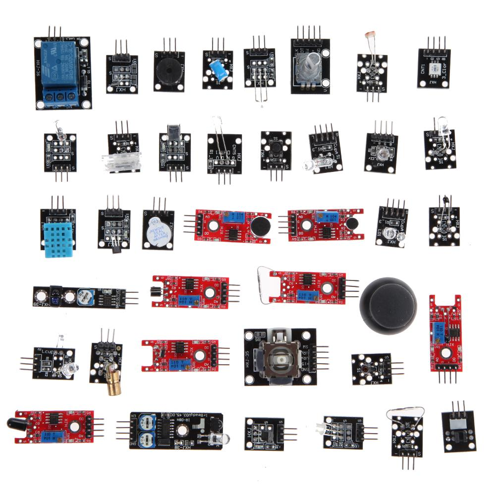

# 1.4 Sensor Kits for STM32

Students who take any of our robotics courses on-site will be given a **FREE** set of sensor kits for STM32. Students are also welcome to puchase the kits from our website at [http://www.longervisionrobot.com/en-us/products/kits-4-stm32](http://www.longervisionrobot.com/en-us/products/kits-4-stm32). Standard Sensor Kit for STM32 from [Longer Vision Robot](http://www.longervisionrobot.com) contains the following components:

