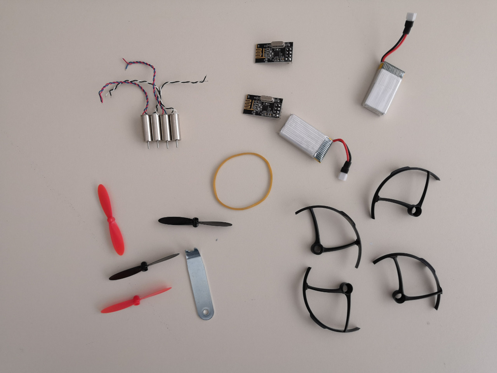

# 1.5 Parts For Drone

Students who take our mini drone course on-site will be given a **FREE** full set of drone with remote controller. Students are also welcome to puchase the kits from our website at [http://www.longervisionrobot.com/en-us/products/drone](http://www.longervisionrobot.com/en-us/products/drone). A full set of drone with remote controller from [Longer Vision Robot](http://www.longervisionrobot.com) contains:

Item
 | 
No. of Pieces
 | 
Model
 | 
Features
   
--------- | ------- | -------- | -------------

FC Power
 | 
2
 | 
36W01
 | 380mAh, 3.7V

Communication
 | 
2
 | 
nRF24L01
 | 2.4G Hz RF 

Hollow Up DC Motor
 | 
4
 | 
720
 | 3.7V, 7*20 mm

Rotor Wing
 | 
4
 | | 

Rotor Wing Protector
 | 
4
 | | 

Puller
 | 
1
 | | 

Elastic
 | 
1
 | | 

