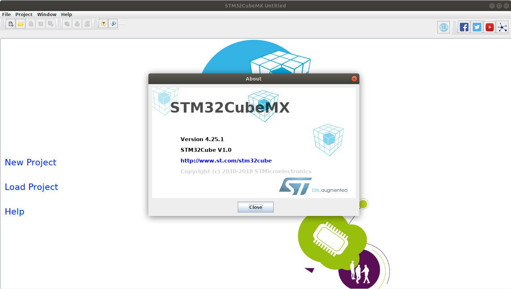

# 2.1 STM32Cube MCU Packages  


## 2.1.1 STM32CubeF7

Since we are using a **STM32F767ZI** development board, the corresponding MCU packages are needed to be installed.

According to ST's official website [http://www.st.com/en/embedded-software/stm32cubef7.html](http://www.st.com/en/embedded-software/stm32cubef7.html),

> STMCube™ is an STMicroelectronics original initiative to make developers' lives easier by reducing development effort, time and cost. STM32Cube is the implementation of STMCube that covers the whole STM32 portfolio.

> STM32Cube includes STM32CubeMX, a graphical software configuration tool that allows the generation of C initialization code using graphical wizards.

> It also comprises the STM32CubeF7 MCU Package composed of the STM32Cube hardware abstraction layer (HAL) and the low-layer (LL) APIs, plus a consistent set of middleware components (RTOS, USB, FAT file system, Graphics and TCP/IP). All embedded software utilities are delivered with a full set of examples running on STMicroelectronics boards.

On website [http://www.st.com/en/embedded-software/stm32cubef7.html](http://www.st.com/en/embedded-software/stm32cubef7.html), click on **Get Software** at the bottom, and **Accept** the **License Agreement**. A file named **en.stm32cubef7.zip** will be downloaded. Afterwards, we extract it somewhere. Then, we copy the entire folder **STM32Cube_FW_F7_V1.11.0** under folder **/opt** and briefly have a look what's under this folder: 

```
/opt/STM32Cube_FW_F7_V1.11.0/Drivers$ ls
BSP  CMSIS  STM32F7xx_HAL_Driver
/opt/STM32Cube_FW_F7_V1.11.0/Drivers$ ls BSP
Adafruit_Shield  STM32746G-Discovery  STM32F723E-Discovery  STM32F769I_EVAL
Components       STM32756G_EVAL       STM32F769I-Discovery  STM32F7xx_Nucleo_144
/opt/STM32Cube_FW_F7_V1.11.0/Drivers$ ls CMSIS/
CMSIS_END_USER_LICENCE_AGREEMENT.pdf  Device         DSP_Lib  index.html  RTOS
CMSIS_END_USER_LICENCE_AGREEMENT.rtf  Documentation  Include  Lib
/opt/STM32Cube_FW_F7_V1.11.0/Drivers$ ls STM32F7xx_HAL_Driver/
Inc                 Src                          STM32F745xx_User_Manual.chm  STM32F756xx_User_Manual.chm
Release_Notes.html  STM32F733xx_User_Manual.chm  STM32F746xx_User_Manual.chm  STM32F779xx_User_Manual.chm
```

In our case, we do one step more:
```
$ ln -s STM32Cube_FW_F7_V1.11.0/ STM32CubeSDK
```

In the [next section](../02_Programming_for_STM32/02_Prepare_Free_IDEs_for_Developing_STM32.md), we'll configure STM32 MCU packages in Eclipse IDE.


## 2.1.2 STM32CubeMX (Optional)

According to ST's official website [http://www.st.com/en/development-tools/stm32cubemx.html](http://www.st.com/en/development-tools/stm32cubemx.html),

> STM32CubeMX is part of STMicroelectronics STMCube™ original initiative to make developers’ lives easier by reducing development effort, time and cost. STM32Cube covers the whole STM32 portfolio.

> STM32Cube includes STM32CubeMX, a graphical software configuration tool that allows the generation of C initialization code using graphical wizards.

> It also embeds comprehensive STM32Cube MCU Packages, delivered per STM32 microcontroller Series (such as STM32CubeF4 for STM32F4 Series). These packages include the STM32Cube HAL (an STM32 abstraction layer embedded software ensuring maximized portability across the STM32 portfolio), the STM32Cube LL (low-layer APIs, a fast, light-weight, expert-oriented layer), plus a consistent set of middleware components such as RTOS, USB, TCP/IP and graphics. All the embedded software utilities are delivered with a full set of examples.


The reason why **STM32CubeMX** is **optional** for installation is just because **STM32CubeMX** contains comprehensive **STM32Cube MCU Packages**.


On website [http://www.st.com/en/development-tools/stm32cubemx.html](http://www.st.com/en/development-tools/stm32cubemx.html), click on **Get Software** at the bottom, and **Accept** the **License Agreement**. A file named **en.stm32cubemx.zip** will be downloaded. Afterwards, we extract it somewhere. Then, we install it. In our case:
```
$ ./SetupSTM32CubeMX-4.25.1.linux
```

**STM32CubeMX** will be defaultly installed under **/opt/STM32CubeMX**. We can run **STM32CubeMX** by typing:
```
$ ./STM32CubeMX &
```

Afterwards, let's briefly have a look at **STM32CubeMX About**.


