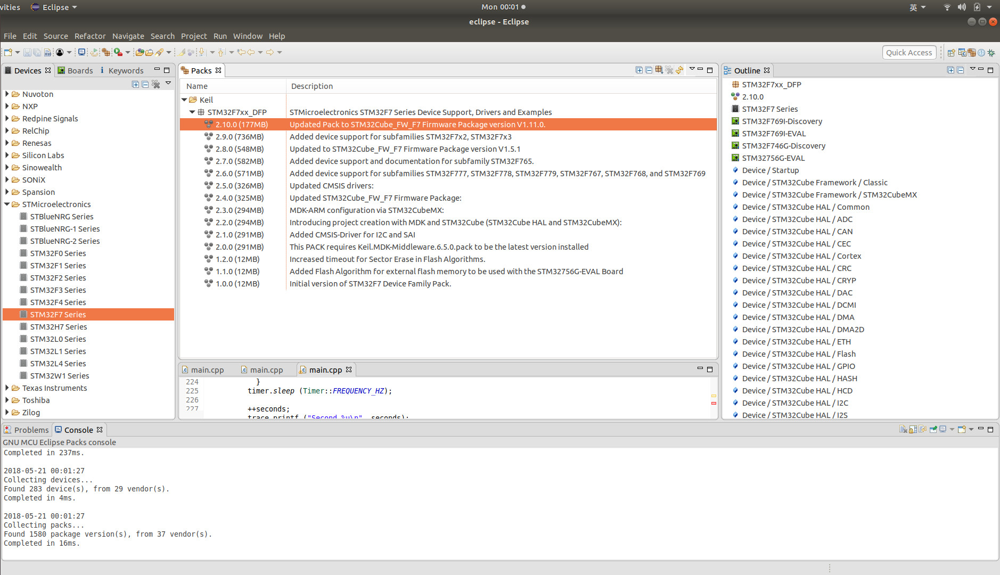
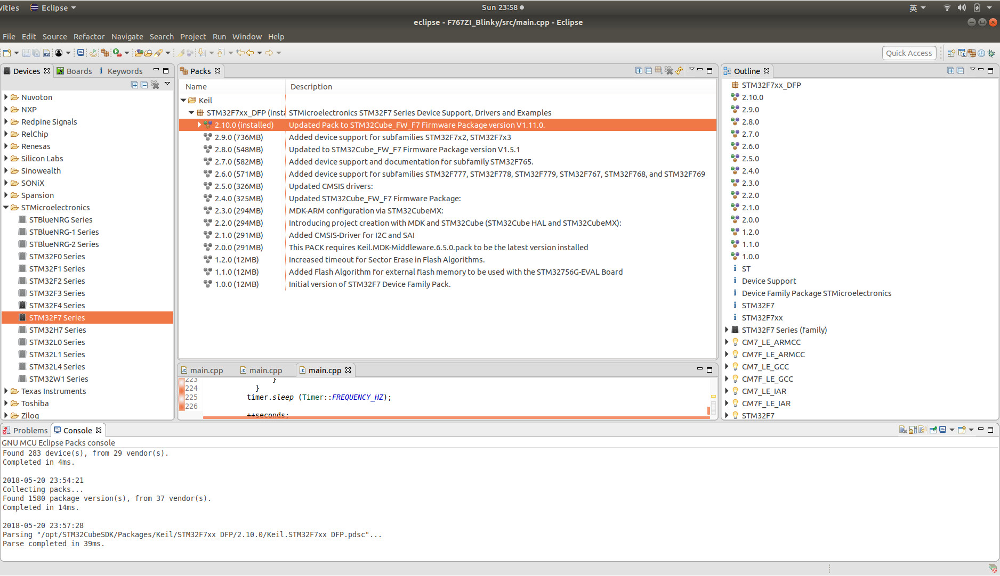
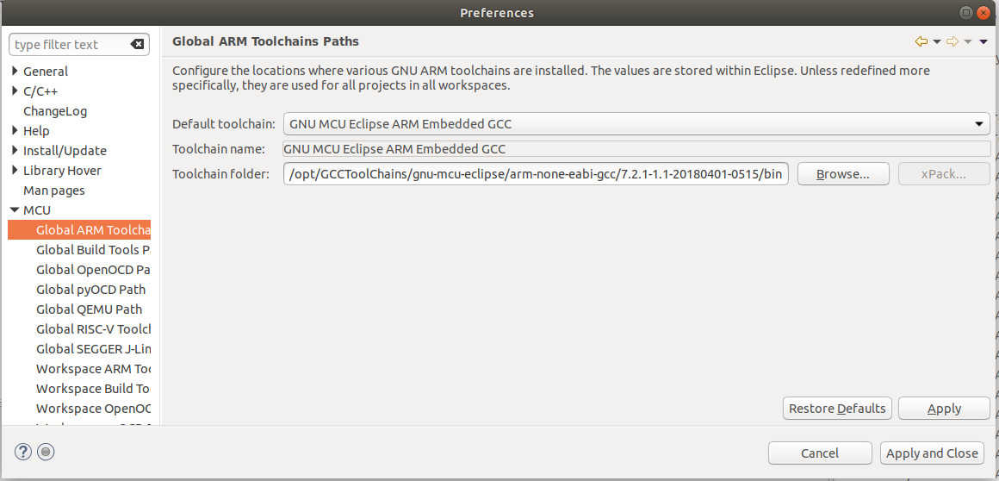
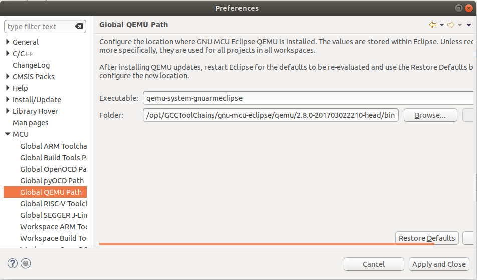

# 2.2 Prepare Free IDEs for Developing STM32

[Longer Vision Robot](http://www.longervisionrobot.com) strongly recommend two free IDEs for developming STM32:
* [GNU MCU Eclipse](https://gnu-mcu-eclipse.github.io)
* [System Workbench for STM32](http://www.st.com/en/development-tools/sw4stm32.html)

And [GNU MCU Eclipse](https://gnu-mcu-eclipse.github.io/) is adopted in our case.


## 2.2.1 GNU MCU Eclipse

### Step 1: Install Eclipse

It's supposed that students have already installed [Eclipse](https://www.eclipse.org). For the time being, the most recent Eclipse release is [Eclipse Oxygen 3A](https://www.eclipse.org/downloads/packages/release/Oxygen/3A), and what we are using is [Eclipse IDE for C/C++ Developers - Linux 64-bit](http://www.eclipse.org/downloads/download.php?file=/technology/epp/downloads/release/oxygen/3a/eclipse-cpp-oxygen-3a-linux-gtk-x86_64.tar.gz).


### Step 2: Install GNU MCU Plug-ins for Eclipse

According to [GNU MCU Eclipse](https://gnu-mcu-eclipse.github.io):
> GNU MCU Eclipse is an open source project that includes a family of Eclipse plug-ins and tools for multi-platform embedded [ARM](https://www.arm.com/) and [RISC-V](https://riscv.org/) development, based on GNU toolchains. This project is hosted on [GitHub](https://github.com/gnu-mcu-eclipse). The former project was hosted on [GitHub](https://github.com/gnuarmeclipse) and [SourceForge](http://sourceforge.net/projects/gnuarmeclipse/).

The right-hand sidebar on [GNU MCU Eclipse](https://gnu-mcu-eclipse.github.io/) clearly summarizes what's needed to be installed, as in the following image:


According to our summation, four things must be installed:
* [Eclipse Plug-in](https://gnu-mcu-eclipse.github.io/plugins/download/)
* [ARM toolchain](https://gnu-mcu-eclipse.github.io/toolchain/arm/install/)
* [J-Link](https://gnu-mcu-eclipse.github.io/debug/jlink/install/)
* [ST-Link](https://github.com/texane/stlink)


#### A. Install Eclipse Plug-in

Currently, if you install the plugin from within Eclipse by providing the plugin's update site URL [http://gnu-mcu-eclipse.netlify.com/v4-neon-updates](http://gnu-mcu-eclipse.netlify.com/v4-neon-updates), you will possibly meet the following error message:


Therefore, we have this Eclipse Plugin installed from within Eclipse MarketPlace as follows:


#### B. Install ARM Toolchain

It's clearly summarized in [https://gnu-mcu-eclipse.github.io/toolchain/arm/install/](https://gnu-mcu-eclipse.github.io/toolchain/arm/install/) that there are 2 ways to carry out the installation for GNU MCU Eclipse ARM Embedded GCC: **The xPack install** and **Manual install**.

**The manual install** is strongly recommended. You **ONLY** need to visit [GNU MCU Eclipse ARM Embedded GCC](https://github.com/gnu-mcu-eclipse/arm-none-eabi-gcc/releases), and download the corresponding file. [gnu-mcu-eclipse-arm-none-eabi-gcc-7.2.1-1.1-20180401-0515-centos64.tgz](https://github.com/gnu-mcu-eclipse/arm-none-eabi-gcc/releases/download/v7.2.1-1.1/gnu-mcu-eclipse-arm-none-eabi-gcc-7.2.1-1.1-20180401-0515-centos64.tgz) is downloaded and extracted under **/opt/GCCToolChains** in our case. Let's have a look at what files are under the ARM toolchain folder:

```
/opt/GCCToolChains/gnu-mcu-eclipse/arm-none-eabi-gcc/7.2.1-1.1-20180401-0515/bin$ ls
arm-none-eabi-addr2line  arm-none-eabi-elfedit    arm-none-eabi-gcc-ranlib  arm-none-eabi-gprof    arm-none-eabi-ranlib
arm-none-eabi-ar         arm-none-eabi-g++        arm-none-eabi-gcov        arm-none-eabi-ld       arm-none-eabi-readelf
arm-none-eabi-as         arm-none-eabi-gcc        arm-none-eabi-gcov-dump   arm-none-eabi-ld.bfd   arm-none-eabi-size
arm-none-eabi-c++        arm-none-eabi-gcc-7.2.1  arm-none-eabi-gcov-tool   arm-none-eabi-nm       arm-none-eabi-strings
arm-none-eabi-c++filt    arm-none-eabi-gcc-ar     arm-none-eabi-gdb         arm-none-eabi-objcopy  arm-none-eabi-strip
arm-none-eabi-cpp        arm-none-eabi-gcc-nm     arm-none-eabi-gdb-py      arm-none-eabi-objdump
```


#### C. Install J-Link

The J-Link binaries are available at [SEGGER](http://www.segger.com/jlink-software.html). In our case, **DEB installer 64-bit** is to be downloaded from [https://www.segger.com/downloads/jlink/JLink_Linux_x86_64.deb](https://www.segger.com/downloads/jlink/JLink_Linux_x86_64.deb). And to install it, we **ONLY** need to double-click this **deb** file under Ubuntu.

**J-Link** is defaultly installed under folder **/opt/SEGGER**.
```
/opt/SEGGER$ ls -ls
total 4
0 lrwxrwxrwx 1 root root   23 May 11 07:33 JLink -> /opt/SEGGER/JLink_V632c
4 drwxr-xr-x 8 root root 4096 May 15 13:04 JLink_V632c
```


#### D. Install ST-Link

The reason why we need to install [ST-Link](https://github.com/texane/stlink) is that [Nucleo-144 board with STM32F767ZI](../../Part1_Introduction/01_Getting_Started_with_STM32/02_Nucleo-144_STM32F767ZI.md) comes with a ST-Link on board. The processes on how to checkout and build the source code are clearly displayed by the following commands:
```
$ git clone git@github.com:jiapei100/stlink.git
$ cd stlink
$ mkdir build
$ cd build
$ ccmake ../
$ make -j8
$ sudo make install
```

Four **exe** files are respectively installed as:
* /usr/local/bin/st-flash
* /usr/local/bin/st-info
* /usr/local/bin/st-util
* /usr/local/bin/stlink-gui


### Step 3: Update Packs


#### A. Set MCU Packages and Package Repositories


According to the description on [https://gnu-mcu-eclipse.github.io/plugins/packs-manager/](https://gnu-mcu-eclipse.github.io/plugins/packs-manager/), we need to input [http://www.keil.com/pack/index.pidx](http://www.keil.com/pack/index.pidx) into **URL** in dialog **MCU Packages - Repositories**, as follows:


#### B. Packs: Open Perspective

Click on **Window**->**Perspective**->**Open Perspective**->**Other**, you will see the following perspective:


#### C. Packs: Operation In Progress

Then double click **Packs**, and click the **refresh button** to **Update the packages definitions from all repositories**.


#### D. Packs: Install Required Packs

After around half an hour on my computer, and multiple times of clicking **Retry** and **Ignore**, I got the following views:



It's **NOT** hard to find **STMicroelectronics**->**STM32F7 Series** and have **STM32F7xx_DFP** installed. The **NEWEST** version 2.10.0 will be installed by default.



<span style="color:red">**Note**: You might meet this **ERROR** while installing a pack.</span>
<span style="color:red">**java.security.InvalidAlgorithmParameterException: the trustAnchors parameter must be non-empty**</span>

<span style="color:red">This is a bug from Java, and the solution can be found on [https://github.com/mikaelhg/broken-docker-jdk9-cacerts](https://github.com/mikaelhg/broken-docker-jdk9-cacerts). Be more specific, the solutions is:</span>

```
$ /usr/bin/printf '\xfe\xed\xfe\xed\x00\x00\x00\x02\x00\x00\x00\x00\xe2\x68\x6e\x45\xfb\x43\xdf\xa4\xd9\x92\xdd\x41\xce\xb6\xb2\x1c\x63\x30\xd7\x92' > /etc/ssl/certs/java/cacerts
$ /var/lib/dpkg/info/ca-certificates-java.postinst configure
```


### Step 4: Window Preference

Finally, we configure Eclipse IDE for STM32 MCU development. Click on **Window**->**Preferences**.


#### A. MCU Configuration

##### Global ARM Toolchains Paths




**Alternatively**, you can configure **OpenOCD** toolchain instead.


**Alternatively**, you can configure **RISC-V** toolchain instead.


##### Global QEMU Path




##### Global SEGGER J-Link Path


#### B. Workspace Preference

Just enable **save automatically before build** and **UTF-8** encoding within **Workspace Preference**.


## 2.2.2 SW4STM32 (System Workbench for STM32)

To install the free IDE [System Workbench for STM32](http://www.st.com/en/development-tools/sw4stm32.html), [ST's official website](http://www.st.com/en/development-tools/sw4stm32.html) is redirected to [OpenSTM32](http://www.openstm32.org/). Users must first register on [OpenSTM32](http://www.openstm32.org/), and then strictly follow [Installing System Workbench for STM32](http://www.openstm32.org/Installing%2BSystem%2BWorkbench%2Bfor%2BSTM32).

Since we are going to use [2.2.1 GNU MCU Eclipse](https://gnu-mcu-eclipse.github.io/) throughout our course, we are **NOT** going to elaborate how to carry out the development for STM32 using [System Workbench for STM32](http://www.st.com/en/development-tools/sw4stm32.html).

