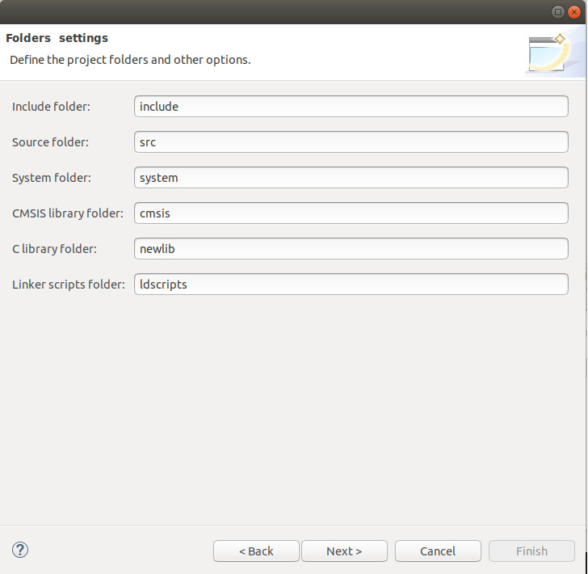
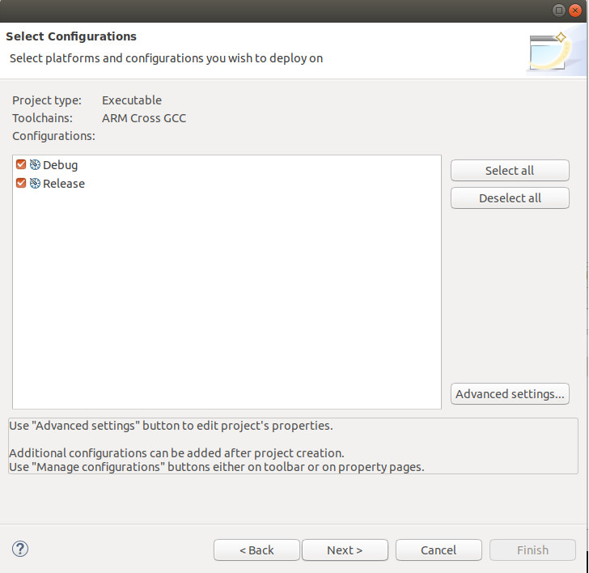
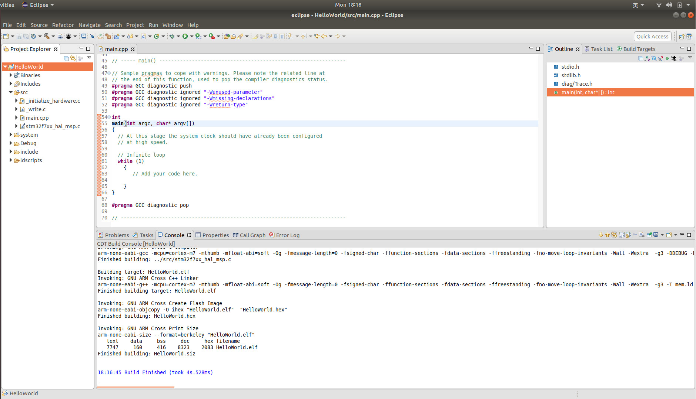
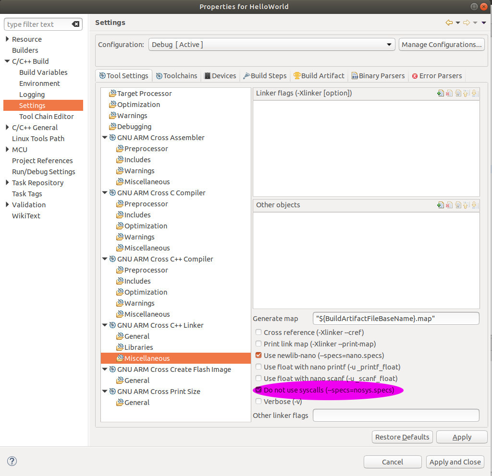
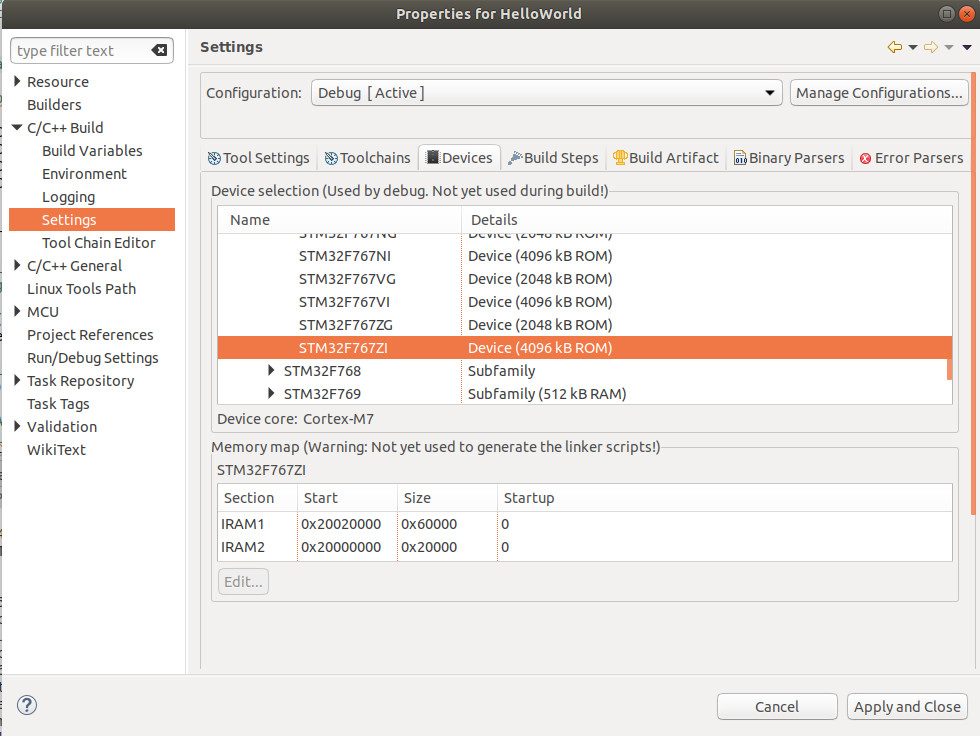

# 2.3 FIRST STM32 Project - "Hello World"

As any other programming languages, our first STM32 Project is also "Hello World", without hardware wiring. Using GNU MCU Eclipse to develop STM32 follows the same way to develop any other projects under Eclipse.


## 2.3.1 Create a Project Under Eclipse

### Steps to Build Our First Empty Project

#### A. Create an Empty Project

**File**->**New**->**C/C++ Project**, then click on **C++ Managed Build**:


Then, click **Next**.


#### B. Select STM32F7XX C/C++ Project

In the dialog **C++ Project**,
* under **Project type:**->**Executable**, select **STM32F7XX C/C++ Project**
* under **Project name:**, input **Hello World**


Then, click **Next**.


#### C. Target Processor Settings

In the dialog **Target Processor Settings**， 
* under **Chip family**, select **STM32F767xx**
* under **Flash size (kB):**, make sure it's **2048**
* under **External clock (Hz):"**, make sure it's **8000000**
* under **Content:**, select **Empty (add your own content)**
* under **Use system calls:**, select **Freestanding (no POSIX system calls)**


Then, click **Next**.


#### D. Folder settings



Just click **Next**.


#### E. Select Configurations



Just click **Next**.


#### F. GNU ARM Cross Toolchain

In the dialog **GNU ARM Cross Toolchain**,
* under **Toolchain name:**, select **GNU MCU Eclipse ARM Embedded GCC (arm-none-eabi-gcc)**
* under **Toolchain path:**, make sure you put the correct **toolchain directory**. In our case:
```
$ ls /opt/GCCToolChains/gnu-mcu-eclipse/arm-none-eabi-gcc/7/bin
arm-none-eabi-addr2line  arm-none-eabi-elfedit    arm-none-eabi-gcc-ranlib  arm-none-eabi-gprof    arm-none-eabi-ranlib
arm-none-eabi-ar         arm-none-eabi-g++        arm-none-eabi-gcov        arm-none-eabi-ld       arm-none-eabi-readelf
arm-none-eabi-as         arm-none-eabi-gcc        arm-none-eabi-gcov-dump   arm-none-eabi-ld.bfd   arm-none-eabi-size
arm-none-eabi-c++        arm-none-eabi-gcc-7.2.1  arm-none-eabi-gcov-tool   arm-none-eabi-nm       arm-none-eabi-strings
arm-none-eabi-c++filt    arm-none-eabi-gcc-ar     arm-none-eabi-gdb         arm-none-eabi-objcopy  arm-none-eabi-strip
arm-none-eabi-cpp        arm-none-eabi-gcc-nm     arm-none-eabi-gdb-py      arm-none-eabi-objdump
```


Finally, click **Finish**.


#### G. Build the Empty Project

Now, let's have a look at the empty project's code:

```
#include <stdio.h>
#include <stdlib.h>
#include "diag/Trace.h"

// ----------------------------------------------------------------------------
//
// Standalone STM32F7 empty sample (trace via DEBUG).
//
// Trace support is enabled by adding the TRACE macro definition.
// By default the trace messages are forwarded to the DEBUG output,
// but can be rerouted to any device or completely suppressed, by
// changing the definitions required in system/src/diag/trace_impl.c
// (currently OS_USE_TRACE_ITM, OS_USE_TRACE_SEMIHOSTING_DEBUG/_STDOUT).
//

// ----- main() ---------------------------------------------------------------

// Sample pragmas to cope with warnings. Please note the related line at
// the end of this function, used to pop the compiler diagnostics status.
#pragma GCC diagnostic push
#pragma GCC diagnostic ignored "-Wunused-parameter"
#pragma GCC diagnostic ignored "-Wmissing-declarations"
#pragma GCC diagnostic ignored "-Wreturn-type"

int
main(int argc, char* argv[])
{
  // At this stage the system clock should have already been configured
  // at high speed.

  // Infinite loop
  while (1)
    {
       // Add your code here.

    }
}

#pragma GCC diagnostic pop

// ----------------------------------------------------------------------------
```

Then, we **Build Project**,




## 2.3.2 Print Out "Hello World"

### Steps to Build "Hello World"


#### A. Code Modification

In file **main.cpp**, add one line **printf("Hello World!\n");** under **Add your code here.** as:

```
// Add your code here.
printf("Hello World!\n");
```


#### B. Build Project - Failure


Why? In the next step, we are going to solve the problem.


#### C. --specs=nosys.specs

To build the project successfully, we need to set **--specs=nosys.specs**. But, how to?
**HelloWorld**->**Properties**->**C/C++ Build**->**Settings**->**Tool Settings**->**GNU ARM Cross C++ Linker**->**Miscellaneous**, and tick **Do not use syscalls(-specs=nosys.specs)**.





Then, we **Apply**.


#### D. Devices STM32F767ZI

Then, we move to **Devices** tab, and we found **STM32F767ZI**.



Then, we **Apply and Close**.


#### E. Build Project Again - Successful


