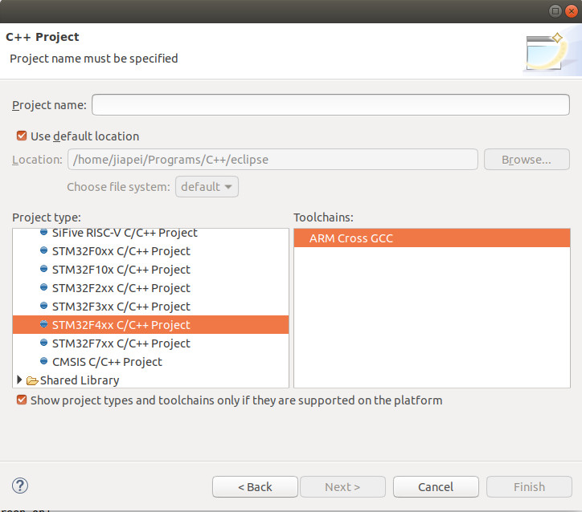
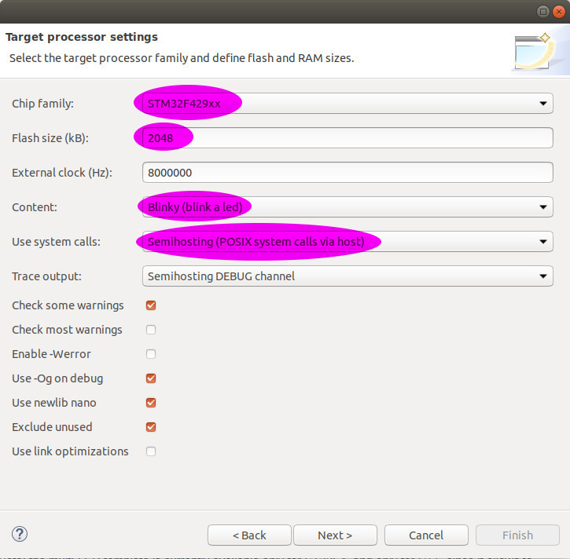
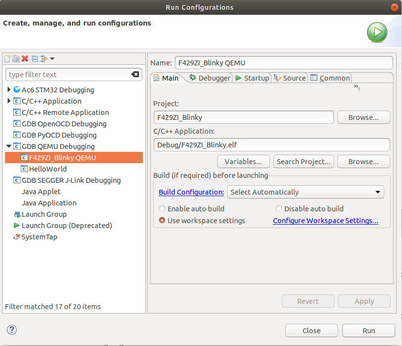
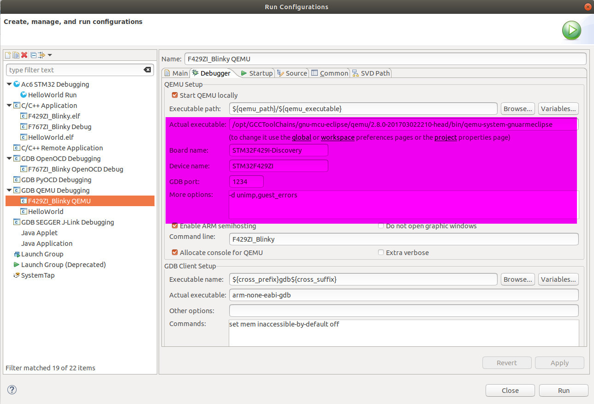
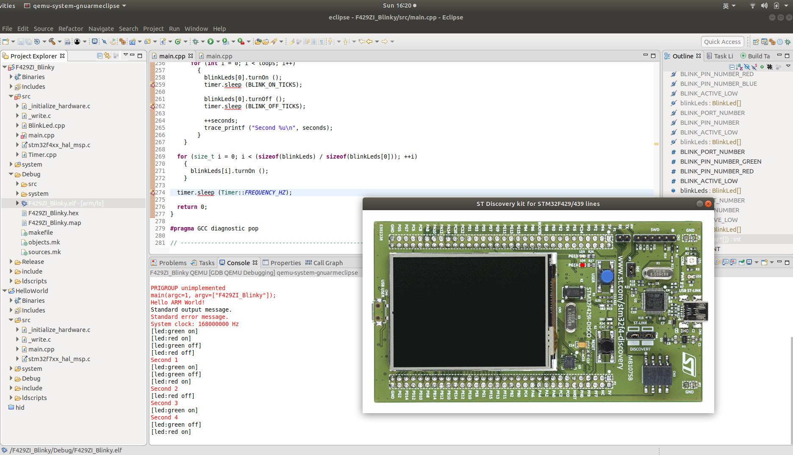

# 2.4 QEMU Simulation (Optional)

In the [previous section](../02_Programming_for_STM32/03_Hello_World.md), we have **NOT** run/test/debug the program yet. How to do that? Normally, there are 2 ways to test your code before flashing your code down to a chip. 
* **Way 1**: Test in a simulator, which simulates the **STM32** chip
* **Way 2**: Test on a real **STM32** development board

In this section, we are going to talk about how to run/test/debug the program in the popular simulator [**QEMU**](https://www.qemu.org/).


## 2.4.1 QEMU Installation

### Option 1: Official Installation

You can directly download QEMU's **NEWEST** release from its official website [https://www.qemu.org](https://www.qemu.org).

### Option 2: Ubuntu Repository

One command will do:
```
$ sudo apt install qemu
```

### Option 3: Build from Source (Recommended)

This option is adopted in our case. Just strictly follow [https://www.qemu.org/download/#source](https://www.qemu.org/download/#source):
```
git clone git://git.qemu.org/qemu.git
cd qemu
git submodule init
git submodule update --recursive
mkdir build
cd build
../configure
make -j4
```

### Option 4: GNU MCU Eclipse QEMU (Our Way)

Since in our course, we are using [GNU MCU Eclipse Plugin](https://gnu-mcu-eclipse.github.io/), we also use [its own QEMU simulator](https://gnu-mcu-eclipse.github.io/qemu/install/), from where we should be able to find its [releases on Github](https://github.com/gnu-mcu-eclipse/qemu/releases). However, its **NEWEST** release is **v2.8.0-20170301**, which is quite **OLD**. According to [GNU MCU Eclipse QEMU](https://gnu-mcu-eclipse.github.io/qemu/), its current supported boards and MCUs:

**Supported Boards**:
* **Maple** - LeafLab Arduino-style STM32 microcontroller board
* **NUCLEO-F103RB** - ST Nucleo Development Board for STM32 F1 series
* **NetduinoGo** - Netduino GoBus Development Board with STM32F4
* **NetduinoPlus2** - Netduino Development Board with STM32F4
* **STM32-E407** - Olimex Development Board for STM32F407ZGT6
* **STM32-H103** - Olimex Header Board for STM32F103RBT6
* **STM32-P103** - Olimex Prototype Board for STM32F103RBT6
* **STM32-P107** - Olimex Prototype Board for STM32F107VCT6
* **STM32F4-Discovery** - ST Discovery kit for STM32F407/417 lines
* **STM32F429I-Discovery** - ST Discovery kit for STM32F429/439 lines

**Supported MCUs**:
* **STM32F103RB**
* **STM32F107VC**
* **STM32F405RG**
* **STM32F407VG**
* **STM32F407ZG**
* **STM32F429ZI**
* **STM32L152RE**


## 2.4.2 Test QEMU

### Step 1: Create and Build Project

As mentioned above, since current [GNU MCU Eclipse QEMU](https://gnu-mcu-eclipse.github.io/qemu/) does **NOT** support **STM32F767ZI** yet, we have to carry our QEMU test with another board. Here, we pick up board [STM32F429I-Discovery](http://www.st.com/en/evaluation-tools/32f429idiscovery.html) with MCU [STM32F429ZI](http://www.st.com/en/microcontrollers/stm32f429zi.html) to carry out QEMU test.

Similar to [previous section](../02_Programming_for_STM32/03_Hello_World.md), let's first create a **Blinky** C/C++ project with board configuration **STM32F4xx** with Chip family **STM32F429xx**, as follows:





Then, we **Build Project** with any [ARM Embedded GCC Toolchain](../01_Getting_Started_with_STM32/06_online_resource.md). In our case, we build our code with **Debug** configuration with [GNU MCU Eclipse ARM Embedded GCC Toolchain](https://github.com/gnu-mcu-eclipse/arm-none-eabi-gcc/releases).


```
12:38:20 **** Build of configuration Debug for project F429ZI_Blinky ****
make all 
Building file: ../system/src/stm32f4-hal/stm32f4xx_hal.c
Invoking: GNU ARM Cross C Compiler
arm-none-eabi-gcc -mcpu=cortex-m4 -mthumb -mfloat-abi=soft -Og -fmessage-length=0 -fsigned-char -ffunction-sections -fdata-sections -fno-move-loop-invariants -Wall -Wextra  -g3 -DDEBUG -DUSE_FULL_ASSERT -DOS_USE_SEMIHOSTING -DTRACE -DOS_USE_TRACE_SEMIHOSTING_DEBUG -DSTM32F429xx -DUSE_HAL_DRIVER -DHSE_VALUE=8000000 -I"../include" -I"../system/include" -I"../system/include/cmsis" -I"../system/include/stm32f4-hal" -std=gnu11 -Wno-bad-function-cast -Wno-conversion -Wno-sign-conversion -Wno-unused-parameter -Wno-sign-compare -Wno-missing-prototypes -Wno-missing-declarations -MMD -MP -MF"system/src/stm32f4-hal/stm32f4xx_hal.d" -MT"system/src/stm32f4-hal/stm32f4xx_hal.o" -c -o "system/src/stm32f4-hal/stm32f4xx_hal.o" "../system/src/stm32f4-hal/stm32f4xx_hal.c"
Finished building: ../system/src/stm32f4-hal/stm32f4xx_hal.c
 
Building file: ../system/src/stm32f4-hal/stm32f4xx_hal_cortex.c
Invoking: GNU ARM Cross C Compiler
arm-none-eabi-gcc -mcpu=cortex-m4 -mthumb -mfloat-abi=soft -Og -fmessage-length=0 -fsigned-char -ffunction-sections -fdata-sections -fno-move-loop-invariants -Wall -Wextra  -g3 -DDEBUG -DUSE_FULL_ASSERT -DOS_USE_SEMIHOSTING -DTRACE -DOS_USE_TRACE_SEMIHOSTING_DEBUG -DSTM32F429xx -DUSE_HAL_DRIVER -DHSE_VALUE=8000000 -I"../include" -I"../system/include" -I"../system/include/cmsis" -I"../system/include/stm32f4-hal" -std=gnu11 -Wno-bad-function-cast -Wno-conversion -Wno-sign-conversion -Wno-unused-parameter -Wno-sign-compare -Wno-missing-prototypes -Wno-missing-declarations -MMD -MP -MF"system/src/stm32f4-hal/stm32f4xx_hal_cortex.d" -MT"system/src/stm32f4-hal/stm32f4xx_hal_cortex.o" -c -o "system/src/stm32f4-hal/stm32f4xx_hal_cortex.o" "../system/src/stm32f4-hal/stm32f4xx_hal_cortex.c"
Finished building: ../system/src/stm32f4-hal/stm32f4xx_hal_cortex.c
 
Building file: ../system/src/stm32f4-hal/stm32f4xx_hal_dfsdm.c
Invoking: GNU ARM Cross C Compiler
arm-none-eabi-gcc -mcpu=cortex-m4 -mthumb -mfloat-abi=soft -Og -fmessage-length=0 -fsigned-char -ffunction-sections -fdata-sections -fno-move-loop-invariants -Wall -Wextra  -g3 -DDEBUG -DUSE_FULL_ASSERT -DOS_USE_SEMIHOSTING -DTRACE -DOS_USE_TRACE_SEMIHOSTING_DEBUG -DSTM32F429xx -DUSE_HAL_DRIVER -DHSE_VALUE=8000000 -I"../include" -I"../system/include" -I"../system/include/cmsis" -I"../system/include/stm32f4-hal" -std=gnu11 -Wno-bad-function-cast -Wno-conversion -Wno-sign-conversion -Wno-unused-parameter -Wno-sign-compare -Wno-missing-prototypes -Wno-missing-declarations -MMD -MP -MF"system/src/stm32f4-hal/stm32f4xx_hal_dfsdm.d" -MT"system/src/stm32f4-hal/stm32f4xx_hal_dfsdm.o" -c -o "system/src/stm32f4-hal/stm32f4xx_hal_dfsdm.o" "../system/src/stm32f4-hal/stm32f4xx_hal_dfsdm.c"
Finished building: ../system/src/stm32f4-hal/stm32f4xx_hal_dfsdm.c
 
Building file: ../system/src/stm32f4-hal/stm32f4xx_hal_flash.c
Invoking: GNU ARM Cross C Compiler
arm-none-eabi-gcc -mcpu=cortex-m4 -mthumb -mfloat-abi=soft -Og -fmessage-length=0 -fsigned-char -ffunction-sections -fdata-sections -fno-move-loop-invariants -Wall -Wextra  -g3 -DDEBUG -DUSE_FULL_ASSERT -DOS_USE_SEMIHOSTING -DTRACE -DOS_USE_TRACE_SEMIHOSTING_DEBUG -DSTM32F429xx -DUSE_HAL_DRIVER -DHSE_VALUE=8000000 -I"../include" -I"../system/include" -I"../system/include/cmsis" -I"../system/include/stm32f4-hal" -std=gnu11 -Wno-bad-function-cast -Wno-conversion -Wno-sign-conversion -Wno-unused-parameter -Wno-sign-compare -Wno-missing-prototypes -Wno-missing-declarations -MMD -MP -MF"system/src/stm32f4-hal/stm32f4xx_hal_flash.d" -MT"system/src/stm32f4-hal/stm32f4xx_hal_flash.o" -c -o "system/src/stm32f4-hal/stm32f4xx_hal_flash.o" "../system/src/stm32f4-hal/stm32f4xx_hal_flash.c"
Finished building: ../system/src/stm32f4-hal/stm32f4xx_hal_flash.c
 
Building file: ../system/src/stm32f4-hal/stm32f4xx_hal_gpio.c
Invoking: GNU ARM Cross C Compiler
arm-none-eabi-gcc -mcpu=cortex-m4 -mthumb -mfloat-abi=soft -Og -fmessage-length=0 -fsigned-char -ffunction-sections -fdata-sections -fno-move-loop-invariants -Wall -Wextra  -g3 -DDEBUG -DUSE_FULL_ASSERT -DOS_USE_SEMIHOSTING -DTRACE -DOS_USE_TRACE_SEMIHOSTING_DEBUG -DSTM32F429xx -DUSE_HAL_DRIVER -DHSE_VALUE=8000000 -I"../include" -I"../system/include" -I"../system/include/cmsis" -I"../system/include/stm32f4-hal" -std=gnu11 -Wno-bad-function-cast -Wno-conversion -Wno-sign-conversion -Wno-unused-parameter -Wno-sign-compare -Wno-missing-prototypes -Wno-missing-declarations -MMD -MP -MF"system/src/stm32f4-hal/stm32f4xx_hal_gpio.d" -MT"system/src/stm32f4-hal/stm32f4xx_hal_gpio.o" -c -o "system/src/stm32f4-hal/stm32f4xx_hal_gpio.o" "../system/src/stm32f4-hal/stm32f4xx_hal_gpio.c"
Finished building: ../system/src/stm32f4-hal/stm32f4xx_hal_gpio.c
 
Building file: ../system/src/stm32f4-hal/stm32f4xx_hal_iwdg.c
Invoking: GNU ARM Cross C Compiler
arm-none-eabi-gcc -mcpu=cortex-m4 -mthumb -mfloat-abi=soft -Og -fmessage-length=0 -fsigned-char -ffunction-sections -fdata-sections -fno-move-loop-invariants -Wall -Wextra  -g3 -DDEBUG -DUSE_FULL_ASSERT -DOS_USE_SEMIHOSTING -DTRACE -DOS_USE_TRACE_SEMIHOSTING_DEBUG -DSTM32F429xx -DUSE_HAL_DRIVER -DHSE_VALUE=8000000 -I"../include" -I"../system/include" -I"../system/include/cmsis" -I"../system/include/stm32f4-hal" -std=gnu11 -Wno-bad-function-cast -Wno-conversion -Wno-sign-conversion -Wno-unused-parameter -Wno-sign-compare -Wno-missing-prototypes -Wno-missing-declarations -MMD -MP -MF"system/src/stm32f4-hal/stm32f4xx_hal_iwdg.d" -MT"system/src/stm32f4-hal/stm32f4xx_hal_iwdg.o" -c -o "system/src/stm32f4-hal/stm32f4xx_hal_iwdg.o" "../system/src/stm32f4-hal/stm32f4xx_hal_iwdg.c"
Finished building: ../system/src/stm32f4-hal/stm32f4xx_hal_iwdg.c
 
Building file: ../system/src/stm32f4-hal/stm32f4xx_hal_pwr.c
Invoking: GNU ARM Cross C Compiler
arm-none-eabi-gcc -mcpu=cortex-m4 -mthumb -mfloat-abi=soft -Og -fmessage-length=0 -fsigned-char -ffunction-sections -fdata-sections -fno-move-loop-invariants -Wall -Wextra  -g3 -DDEBUG -DUSE_FULL_ASSERT -DOS_USE_SEMIHOSTING -DTRACE -DOS_USE_TRACE_SEMIHOSTING_DEBUG -DSTM32F429xx -DUSE_HAL_DRIVER -DHSE_VALUE=8000000 -I"../include" -I"../system/include" -I"../system/include/cmsis" -I"../system/include/stm32f4-hal" -std=gnu11 -Wno-bad-function-cast -Wno-conversion -Wno-sign-conversion -Wno-unused-parameter -Wno-sign-compare -Wno-missing-prototypes -Wno-missing-declarations -MMD -MP -MF"system/src/stm32f4-hal/stm32f4xx_hal_pwr.d" -MT"system/src/stm32f4-hal/stm32f4xx_hal_pwr.o" -c -o "system/src/stm32f4-hal/stm32f4xx_hal_pwr.o" "../system/src/stm32f4-hal/stm32f4xx_hal_pwr.c"
Finished building: ../system/src/stm32f4-hal/stm32f4xx_hal_pwr.c
 
Building file: ../system/src/stm32f4-hal/stm32f4xx_hal_rcc.c
Invoking: GNU ARM Cross C Compiler
arm-none-eabi-gcc -mcpu=cortex-m4 -mthumb -mfloat-abi=soft -Og -fmessage-length=0 -fsigned-char -ffunction-sections -fdata-sections -fno-move-loop-invariants -Wall -Wextra  -g3 -DDEBUG -DUSE_FULL_ASSERT -DOS_USE_SEMIHOSTING -DTRACE -DOS_USE_TRACE_SEMIHOSTING_DEBUG -DSTM32F429xx -DUSE_HAL_DRIVER -DHSE_VALUE=8000000 -I"../include" -I"../system/include" -I"../system/include/cmsis" -I"../system/include/stm32f4-hal" -std=gnu11 -Wno-bad-function-cast -Wno-conversion -Wno-sign-conversion -Wno-unused-parameter -Wno-sign-compare -Wno-missing-prototypes -Wno-missing-declarations -MMD -MP -MF"system/src/stm32f4-hal/stm32f4xx_hal_rcc.d" -MT"system/src/stm32f4-hal/stm32f4xx_hal_rcc.o" -c -o "system/src/stm32f4-hal/stm32f4xx_hal_rcc.o" "../system/src/stm32f4-hal/stm32f4xx_hal_rcc.c"
Finished building: ../system/src/stm32f4-hal/stm32f4xx_hal_rcc.c
 
Building file: ../system/src/newlib/_cxx.cpp
Invoking: GNU ARM Cross C++ Compiler
arm-none-eabi-g++ -mcpu=cortex-m4 -mthumb -mfloat-abi=soft -Og -fmessage-length=0 -fsigned-char -ffunction-sections -fdata-sections -fno-move-loop-invariants -Wall -Wextra  -g3 -DDEBUG -DUSE_FULL_ASSERT -DOS_USE_SEMIHOSTING -DTRACE -DOS_USE_TRACE_SEMIHOSTING_DEBUG -DSTM32F429xx -DUSE_HAL_DRIVER -DHSE_VALUE=8000000 -I"../include" -I"../system/include" -I"../system/include/cmsis" -I"../system/include/stm32f4-hal" -std=gnu++11 -fabi-version=0 -fno-exceptions -fno-rtti -fno-use-cxa-atexit -fno-threadsafe-statics -MMD -MP -MF"system/src/newlib/_cxx.d" -MT"system/src/newlib/_cxx.o" -c -o "system/src/newlib/_cxx.o" "../system/src/newlib/_cxx.cpp"
Finished building: ../system/src/newlib/_cxx.cpp
 
Building file: ../system/src/newlib/_exit.c
Invoking: GNU ARM Cross C Compiler
arm-none-eabi-gcc -mcpu=cortex-m4 -mthumb -mfloat-abi=soft -Og -fmessage-length=0 -fsigned-char -ffunction-sections -fdata-sections -fno-move-loop-invariants -Wall -Wextra  -g3 -DDEBUG -DUSE_FULL_ASSERT -DOS_USE_SEMIHOSTING -DTRACE -DOS_USE_TRACE_SEMIHOSTING_DEBUG -DSTM32F429xx -DUSE_HAL_DRIVER -DHSE_VALUE=8000000 -I"../include" -I"../system/include" -I"../system/include/cmsis" -I"../system/include/stm32f4-hal" -std=gnu11 -MMD -MP -MF"system/src/newlib/_exit.d" -MT"system/src/newlib/_exit.o" -c -o "system/src/newlib/_exit.o" "../system/src/newlib/_exit.c"
Finished building: ../system/src/newlib/_exit.c
 
Building file: ../system/src/newlib/_sbrk.c
Invoking: GNU ARM Cross C Compiler
arm-none-eabi-gcc -mcpu=cortex-m4 -mthumb -mfloat-abi=soft -Og -fmessage-length=0 -fsigned-char -ffunction-sections -fdata-sections -fno-move-loop-invariants -Wall -Wextra  -g3 -DDEBUG -DUSE_FULL_ASSERT -DOS_USE_SEMIHOSTING -DTRACE -DOS_USE_TRACE_SEMIHOSTING_DEBUG -DSTM32F429xx -DUSE_HAL_DRIVER -DHSE_VALUE=8000000 -I"../include" -I"../system/include" -I"../system/include/cmsis" -I"../system/include/stm32f4-hal" -std=gnu11 -MMD -MP -MF"system/src/newlib/_sbrk.d" -MT"system/src/newlib/_sbrk.o" -c -o "system/src/newlib/_sbrk.o" "../system/src/newlib/_sbrk.c"
Finished building: ../system/src/newlib/_sbrk.c
 
Building file: ../system/src/newlib/_startup.c
Invoking: GNU ARM Cross C Compiler
arm-none-eabi-gcc -mcpu=cortex-m4 -mthumb -mfloat-abi=soft -Og -fmessage-length=0 -fsigned-char -ffunction-sections -fdata-sections -fno-move-loop-invariants -Wall -Wextra  -g3 -DDEBUG -DUSE_FULL_ASSERT -DOS_USE_SEMIHOSTING -DTRACE -DOS_USE_TRACE_SEMIHOSTING_DEBUG -DSTM32F429xx -DUSE_HAL_DRIVER -DHSE_VALUE=8000000 -DOS_INCLUDE_STARTUP_INIT_MULTIPLE_RAM_SECTIONS -I"../include" -I"../system/include" -I"../system/include/cmsis" -I"../system/include/stm32f4-hal" -std=gnu11 -MMD -MP -MF"system/src/newlib/_startup.d" -MT"system/src/newlib/_startup.d" -c -o "system/src/newlib/_startup.o" "../system/src/newlib/_startup.c"
Finished building: ../system/src/newlib/_startup.c
 
Building file: ../system/src/newlib/_syscalls.c
Invoking: GNU ARM Cross C Compiler
arm-none-eabi-gcc -mcpu=cortex-m4 -mthumb -mfloat-abi=soft -Og -fmessage-length=0 -fsigned-char -ffunction-sections -fdata-sections -fno-move-loop-invariants -Wall -Wextra  -g3 -DDEBUG -DUSE_FULL_ASSERT -DOS_USE_SEMIHOSTING -DTRACE -DOS_USE_TRACE_SEMIHOSTING_DEBUG -DSTM32F429xx -DUSE_HAL_DRIVER -DHSE_VALUE=8000000 -I"../include" -I"../system/include" -I"../system/include/cmsis" -I"../system/include/stm32f4-hal" -std=gnu11 -MMD -MP -MF"system/src/newlib/_syscalls.d" -MT"system/src/newlib/_syscalls.o" -c -o "system/src/newlib/_syscalls.o" "../system/src/newlib/_syscalls.c"
Finished building: ../system/src/newlib/_syscalls.c
 
Building file: ../system/src/newlib/assert.c
Invoking: GNU ARM Cross C Compiler
arm-none-eabi-gcc -mcpu=cortex-m4 -mthumb -mfloat-abi=soft -Og -fmessage-length=0 -fsigned-char -ffunction-sections -fdata-sections -fno-move-loop-invariants -Wall -Wextra  -g3 -DDEBUG -DUSE_FULL_ASSERT -DOS_USE_SEMIHOSTING -DTRACE -DOS_USE_TRACE_SEMIHOSTING_DEBUG -DSTM32F429xx -DUSE_HAL_DRIVER -DHSE_VALUE=8000000 -I"../include" -I"../system/include" -I"../system/include/cmsis" -I"../system/include/stm32f4-hal" -std=gnu11 -MMD -MP -MF"system/src/newlib/assert.d" -MT"system/src/newlib/assert.o" -c -o "system/src/newlib/assert.o" "../system/src/newlib/assert.c"
Finished building: ../system/src/newlib/assert.c
 
Building file: ../system/src/diag/Trace.c
Invoking: GNU ARM Cross C Compiler
arm-none-eabi-gcc -mcpu=cortex-m4 -mthumb -mfloat-abi=soft -Og -fmessage-length=0 -fsigned-char -ffunction-sections -fdata-sections -fno-move-loop-invariants -Wall -Wextra  -g3 -DDEBUG -DUSE_FULL_ASSERT -DOS_USE_SEMIHOSTING -DTRACE -DOS_USE_TRACE_SEMIHOSTING_DEBUG -DSTM32F429xx -DUSE_HAL_DRIVER -DHSE_VALUE=8000000 -I"../include" -I"../system/include" -I"../system/include/cmsis" -I"../system/include/stm32f4-hal" -std=gnu11 -MMD -MP -MF"system/src/diag/Trace.d" -MT"system/src/diag/Trace.o" -c -o "system/src/diag/Trace.o" "../system/src/diag/Trace.c"
Finished building: ../system/src/diag/Trace.c
 
Building file: ../system/src/diag/trace_impl.c
Invoking: GNU ARM Cross C Compiler
arm-none-eabi-gcc -mcpu=cortex-m4 -mthumb -mfloat-abi=soft -Og -fmessage-length=0 -fsigned-char -ffunction-sections -fdata-sections -fno-move-loop-invariants -Wall -Wextra  -g3 -DDEBUG -DUSE_FULL_ASSERT -DOS_USE_SEMIHOSTING -DTRACE -DOS_USE_TRACE_SEMIHOSTING_DEBUG -DSTM32F429xx -DUSE_HAL_DRIVER -DHSE_VALUE=8000000 -I"../include" -I"../system/include" -I"../system/include/cmsis" -I"../system/include/stm32f4-hal" -std=gnu11 -MMD -MP -MF"system/src/diag/trace_impl.d" -MT"system/src/diag/trace_impl.o" -c -o "system/src/diag/trace_impl.o" "../system/src/diag/trace_impl.c"
Finished building: ../system/src/diag/trace_impl.c
 
Building file: ../system/src/cortexm/_initialize_hardware.c
Invoking: GNU ARM Cross C Compiler
arm-none-eabi-gcc -mcpu=cortex-m4 -mthumb -mfloat-abi=soft -Og -fmessage-length=0 -fsigned-char -ffunction-sections -fdata-sections -fno-move-loop-invariants -Wall -Wextra  -g3 -DDEBUG -DUSE_FULL_ASSERT -DOS_USE_SEMIHOSTING -DTRACE -DOS_USE_TRACE_SEMIHOSTING_DEBUG -DSTM32F429xx -DUSE_HAL_DRIVER -DHSE_VALUE=8000000 -I"../include" -I"../system/include" -I"../system/include/cmsis" -I"../system/include/stm32f4-hal" -std=gnu11 -MMD -MP -MF"system/src/cortexm/_initialize_hardware.d" -MT"system/src/cortexm/_initialize_hardware.o" -c -o "system/src/cortexm/_initialize_hardware.o" "../system/src/cortexm/_initialize_hardware.c"
Finished building: ../system/src/cortexm/_initialize_hardware.c
 
Building file: ../system/src/cortexm/_reset_hardware.c
Invoking: GNU ARM Cross C Compiler
arm-none-eabi-gcc -mcpu=cortex-m4 -mthumb -mfloat-abi=soft -Og -fmessage-length=0 -fsigned-char -ffunction-sections -fdata-sections -fno-move-loop-invariants -Wall -Wextra  -g3 -DDEBUG -DUSE_FULL_ASSERT -DOS_USE_SEMIHOSTING -DTRACE -DOS_USE_TRACE_SEMIHOSTING_DEBUG -DSTM32F429xx -DUSE_HAL_DRIVER -DHSE_VALUE=8000000 -I"../include" -I"../system/include" -I"../system/include/cmsis" -I"../system/include/stm32f4-hal" -std=gnu11 -MMD -MP -MF"system/src/cortexm/_reset_hardware.d" -MT"system/src/cortexm/_reset_hardware.o" -c -o "system/src/cortexm/_reset_hardware.o" "../system/src/cortexm/_reset_hardware.c"
Finished building: ../system/src/cortexm/_reset_hardware.c
 
Building file: ../system/src/cortexm/exception_handlers.c
Invoking: GNU ARM Cross C Compiler
arm-none-eabi-gcc -mcpu=cortex-m4 -mthumb -mfloat-abi=soft -Og -fmessage-length=0 -fsigned-char -ffunction-sections -fdata-sections -fno-move-loop-invariants -Wall -Wextra  -g3 -DDEBUG -DUSE_FULL_ASSERT -DOS_USE_SEMIHOSTING -DTRACE -DOS_USE_TRACE_SEMIHOSTING_DEBUG -DSTM32F429xx -DUSE_HAL_DRIVER -DHSE_VALUE=8000000 -I"../include" -I"../system/include" -I"../system/include/cmsis" -I"../system/include/stm32f4-hal" -std=gnu11 -MMD -MP -MF"system/src/cortexm/exception_handlers.d" -MT"system/src/cortexm/exception_handlers.o" -c -o "system/src/cortexm/exception_handlers.o" "../system/src/cortexm/exception_handlers.c"
Finished building: ../system/src/cortexm/exception_handlers.c
 
Building file: ../system/src/cmsis/system_stm32f4xx.c
Invoking: GNU ARM Cross C Compiler
arm-none-eabi-gcc -mcpu=cortex-m4 -mthumb -mfloat-abi=soft -Og -fmessage-length=0 -fsigned-char -ffunction-sections -fdata-sections -fno-move-loop-invariants -Wall -Wextra  -g3 -DDEBUG -DUSE_FULL_ASSERT -DOS_USE_SEMIHOSTING -DTRACE -DOS_USE_TRACE_SEMIHOSTING_DEBUG -DSTM32F429xx -DUSE_HAL_DRIVER -DHSE_VALUE=8000000 -I"../include" -I"../system/include" -I"../system/include/cmsis" -I"../system/include/stm32f4-hal" -std=gnu11 -MMD -MP -MF"system/src/cmsis/system_stm32f4xx.d" -MT"system/src/cmsis/system_stm32f4xx.o" -c -o "system/src/cmsis/system_stm32f4xx.o" "../system/src/cmsis/system_stm32f4xx.c"
Finished building: ../system/src/cmsis/system_stm32f4xx.c
 
Building file: ../system/src/cmsis/vectors_stm32f429xx.c
Invoking: GNU ARM Cross C Compiler
arm-none-eabi-gcc -mcpu=cortex-m4 -mthumb -mfloat-abi=soft -Og -fmessage-length=0 -fsigned-char -ffunction-sections -fdata-sections -fno-move-loop-invariants -Wall -Wextra  -g3 -DDEBUG -DUSE_FULL_ASSERT -DOS_USE_SEMIHOSTING -DTRACE -DOS_USE_TRACE_SEMIHOSTING_DEBUG -DSTM32F429xx -DUSE_HAL_DRIVER -DHSE_VALUE=8000000 -I"../include" -I"../system/include" -I"../system/include/cmsis" -I"../system/include/stm32f4-hal" -std=gnu11 -MMD -MP -MF"system/src/cmsis/vectors_stm32f429xx.d" -MT"system/src/cmsis/vectors_stm32f429xx.o" -c -o "system/src/cmsis/vectors_stm32f429xx.o" "../system/src/cmsis/vectors_stm32f429xx.c"
Finished building: ../system/src/cmsis/vectors_stm32f429xx.c
 
Building file: ../src/BlinkLed.cpp
Invoking: GNU ARM Cross C++ Compiler
arm-none-eabi-g++ -mcpu=cortex-m4 -mthumb -mfloat-abi=soft -Og -fmessage-length=0 -fsigned-char -ffunction-sections -fdata-sections -fno-move-loop-invariants -Wall -Wextra  -g3 -DDEBUG -DUSE_FULL_ASSERT -DOS_USE_SEMIHOSTING -DTRACE -DOS_USE_TRACE_SEMIHOSTING_DEBUG -DSTM32F429xx -DUSE_HAL_DRIVER -DHSE_VALUE=8000000 -I"../include" -I"../system/include" -I"../system/include/cmsis" -I"../system/include/stm32f4-hal" -std=gnu++11 -fabi-version=0 -fno-exceptions -fno-rtti -fno-use-cxa-atexit -fno-threadsafe-statics -MMD -MP -MF"src/BlinkLed.d" -MT"src/BlinkLed.o" -c -o "src/BlinkLed.o" "../src/BlinkLed.cpp"
Finished building: ../src/BlinkLed.cpp
 
Building file: ../src/Timer.cpp
Invoking: GNU ARM Cross C++ Compiler
arm-none-eabi-g++ -mcpu=cortex-m4 -mthumb -mfloat-abi=soft -Og -fmessage-length=0 -fsigned-char -ffunction-sections -fdata-sections -fno-move-loop-invariants -Wall -Wextra  -g3 -DDEBUG -DUSE_FULL_ASSERT -DOS_USE_SEMIHOSTING -DTRACE -DOS_USE_TRACE_SEMIHOSTING_DEBUG -DSTM32F429xx -DUSE_HAL_DRIVER -DHSE_VALUE=8000000 -I"../include" -I"../system/include" -I"../system/include/cmsis" -I"../system/include/stm32f4-hal" -std=gnu++11 -fabi-version=0 -fno-exceptions -fno-rtti -fno-use-cxa-atexit -fno-threadsafe-statics -MMD -MP -MF"src/Timer.d" -MT"src/Timer.o" -c -o "src/Timer.o" "../src/Timer.cpp"
Finished building: ../src/Timer.cpp
 
Building file: ../src/_initialize_hardware.c
Invoking: GNU ARM Cross C Compiler
arm-none-eabi-gcc -mcpu=cortex-m4 -mthumb -mfloat-abi=soft -Og -fmessage-length=0 -fsigned-char -ffunction-sections -fdata-sections -fno-move-loop-invariants -Wall -Wextra  -g3 -DDEBUG -DUSE_FULL_ASSERT -DOS_USE_SEMIHOSTING -DTRACE -DOS_USE_TRACE_SEMIHOSTING_DEBUG -DSTM32F429xx -DUSE_HAL_DRIVER -DHSE_VALUE=8000000 -I"../include" -I"../system/include" -I"../system/include/cmsis" -I"../system/include/stm32f4-hal" -std=gnu11 -MMD -MP -MF"src/_initialize_hardware.d" -MT"src/_initialize_hardware.o" -c -o "src/_initialize_hardware.o" "../src/_initialize_hardware.c"
../src/_initialize_hardware.c: In function 'SystemClock_Config':
../src/_initialize_hardware.c:126:2: warning: #warning "Please check if the SystemClock_Config() settings match your board!" [-Wcpp]
 #warning "Please check if the SystemClock_Config() settings match your board!"
  ^~~~~~~
Finished building: ../src/_initialize_hardware.c
 
Building file: ../src/_write.c
Invoking: GNU ARM Cross C Compiler
arm-none-eabi-gcc -mcpu=cortex-m4 -mthumb -mfloat-abi=soft -Og -fmessage-length=0 -fsigned-char -ffunction-sections -fdata-sections -fno-move-loop-invariants -Wall -Wextra  -g3 -DDEBUG -DUSE_FULL_ASSERT -DOS_USE_SEMIHOSTING -DTRACE -DOS_USE_TRACE_SEMIHOSTING_DEBUG -DSTM32F429xx -DUSE_HAL_DRIVER -DHSE_VALUE=8000000 -I"../include" -I"../system/include" -I"../system/include/cmsis" -I"../system/include/stm32f4-hal" -std=gnu11 -MMD -MP -MF"src/_write.d" -MT"src/_write.o" -c -o "src/_write.o" "../src/_write.c"
Finished building: ../src/_write.c
 
Building file: ../src/main.cpp
Invoking: GNU ARM Cross C++ Compiler
arm-none-eabi-g++ -mcpu=cortex-m4 -mthumb -mfloat-abi=soft -Og -fmessage-length=0 -fsigned-char -ffunction-sections -fdata-sections -fno-move-loop-invariants -Wall -Wextra  -g3 -DDEBUG -DUSE_FULL_ASSERT -DOS_USE_SEMIHOSTING -DTRACE -DOS_USE_TRACE_SEMIHOSTING_DEBUG -DSTM32F429xx -DUSE_HAL_DRIVER -DHSE_VALUE=8000000 -I"../include" -I"../system/include" -I"../system/include/cmsis" -I"../system/include/stm32f4-hal" -std=gnu++11 -fabi-version=0 -fno-exceptions -fno-rtti -fno-use-cxa-atexit -fno-threadsafe-statics -MMD -MP -MF"src/main.d" -MT"src/main.o" -c -o "src/main.o" "../src/main.cpp"
../src/main.cpp:121:2: warning: #warning "Assume a STM32F429I-Discovery board, PG13-PG14, active high." [-Wcpp]
 #warning "Assume a STM32F429I-Discovery board, PG13-PG14, active high."
  ^~~~~~~
Finished building: ../src/main.cpp
 
Building file: ../src/stm32f4xx_hal_msp.c
Invoking: GNU ARM Cross C Compiler
arm-none-eabi-gcc -mcpu=cortex-m4 -mthumb -mfloat-abi=soft -Og -fmessage-length=0 -fsigned-char -ffunction-sections -fdata-sections -fno-move-loop-invariants -Wall -Wextra  -g3 -DDEBUG -DUSE_FULL_ASSERT -DOS_USE_SEMIHOSTING -DTRACE -DOS_USE_TRACE_SEMIHOSTING_DEBUG -DSTM32F429xx -DUSE_HAL_DRIVER -DHSE_VALUE=8000000 -I"../include" -I"../system/include" -I"../system/include/cmsis" -I"../system/include/stm32f4-hal" -std=gnu11 -Wno-missing-prototypes -Wno-missing-declarations -MMD -MP -MF"src/stm32f4xx_hal_msp.d" -MT"src/stm32f4xx_hal_msp.d" -c -o "src/stm32f4xx_hal_msp.o" "../src/stm32f4xx_hal_msp.c"
Finished building: ../src/stm32f4xx_hal_msp.c
 
Building target: F429ZI_Blinky.elf
Invoking: GNU ARM Cross C++ Linker
arm-none-eabi-g++ -mcpu=cortex-m4 -mthumb -mfloat-abi=soft -Og -fmessage-length=0 -fsigned-char -ffunction-sections -fdata-sections -fno-move-loop-invariants -Wall -Wextra  -g3 -T mem.ld -T libs.ld -T sections.ld -nostartfiles -Xlinker --gc-sections -L"../ldscripts" -Wl,-Map,"F429ZI_Blinky.map" --specs=nano.specs -o "F429ZI_Blinky.elf"  ./system/src/stm32f4-hal/stm32f4xx_hal.o ./system/src/stm32f4-hal/stm32f4xx_hal_cortex.o ./system/src/stm32f4-hal/stm32f4xx_hal_dfsdm.o ./system/src/stm32f4-hal/stm32f4xx_hal_flash.o ./system/src/stm32f4-hal/stm32f4xx_hal_gpio.o ./system/src/stm32f4-hal/stm32f4xx_hal_iwdg.o ./system/src/stm32f4-hal/stm32f4xx_hal_pwr.o ./system/src/stm32f4-hal/stm32f4xx_hal_rcc.o  ./system/src/newlib/_cxx.o ./system/src/newlib/_exit.o ./system/src/newlib/_sbrk.o ./system/src/newlib/_startup.o ./system/src/newlib/_syscalls.o ./system/src/newlib/assert.o  ./system/src/diag/Trace.o ./system/src/diag/trace_impl.o  ./system/src/cortexm/_initialize_hardware.o ./system/src/cortexm/_reset_hardware.o ./system/src/cortexm/exception_handlers.o  ./system/src/cmsis/system_stm32f4xx.o ./system/src/cmsis/vectors_stm32f429xx.o  ./src/BlinkLed.o ./src/Timer.o ./src/_initialize_hardware.o ./src/_write.o ./src/main.o ./src/stm32f4xx_hal_msp.o   
Finished building target: F429ZI_Blinky.elf
 
Invoking: GNU ARM Cross Create Flash Image
arm-none-eabi-objcopy -O ihex "F429ZI_Blinky.elf"  "F429ZI_Blinky.hex"
Finished building: F429ZI_Blinky.hex
 
Invoking: GNU ARM Cross Print Size
arm-none-eabi-size --format=berkeley "F429ZI_Blinky.elf"
   text	   data	    bss	    dec	    hex	filename
  13278	    520	    740	  14538	   38ca	F429ZI_Blinky.elf
Finished building: F429ZI_Blinky.siz
 

12:38:24 Build Finished (took 3s.574ms)
```

As you can see, a file named **F429ZI_Blinky.elf** is produced under folder **Debug** or **Release**, depending on what kind of target/configuration you specified to build.


### Step 2: Run Project with QEMU

Finally, we need to run the project by emulating **STM32F429I-Discovery** with chip **STM32F429ZI** via **QEMU**. Right click on the built file **HelloWorld.elf** -> **Run As** -> **Run Configurations** -> **GDB QEMU Debugging** -> **New**. We creat a new configuration named **F429ZI_Blinky QEMU**, and make the **Run Configurations** as in the following two images:





And the project **Blinky** successfully run with the following output:

```

GNU ARM Eclipse 64-bits QEMU v2.8.0 (qemu-system-gnuarmeclipse).
Board: 'STM32F429I-Discovery' (ST Discovery kit for STM32F429/439 lines).
Device: 'STM32F429ZI' (Cortex-M4 r0p0, MPU, 4 NVIC prio bits, 91 IRQs), Flash: 2048 kB, RAM: 192 kB.
Command line: 'F429ZI_Blinky' (13 bytes).
Cortex-M4 r0p0 core initialised.
GDB Server listening on: 'tcp::1234'...
Cortex-M4 r0p0 core reset.

... connection accepted from 127.0.0.1.

Execute 'mon system_reset'.
Cortex-M4 r0p0 core reset.

PRIGROUP unimplemented
main(argc=1, argv=["F429ZI_Blinky"]);
Hello ARM World!
Standard output message.
Standard error message.
System clock: 168000000 Hz
[led:green on]
[led:red on]
[led:green off]
[led:red off]
Second 1
[led:green on]
[led:green off]
[led:red on]
Second 2
[led:red off]
Second 3
[led:green on]
Second 4
[led:green off]
[led:red on]
Second 5
[led:green on]
[led:green off]
Second 6
[led:red off]
Second 7
[led:green on]
[led:red on]

QEMU semihosting exit(0)
```

And [GNU MCU Eclipse QEMU](https://gnu-mcu-eclipse.github.io/qemu/) emulates **STM32F429I-Discovery** board on the screen as follows:



