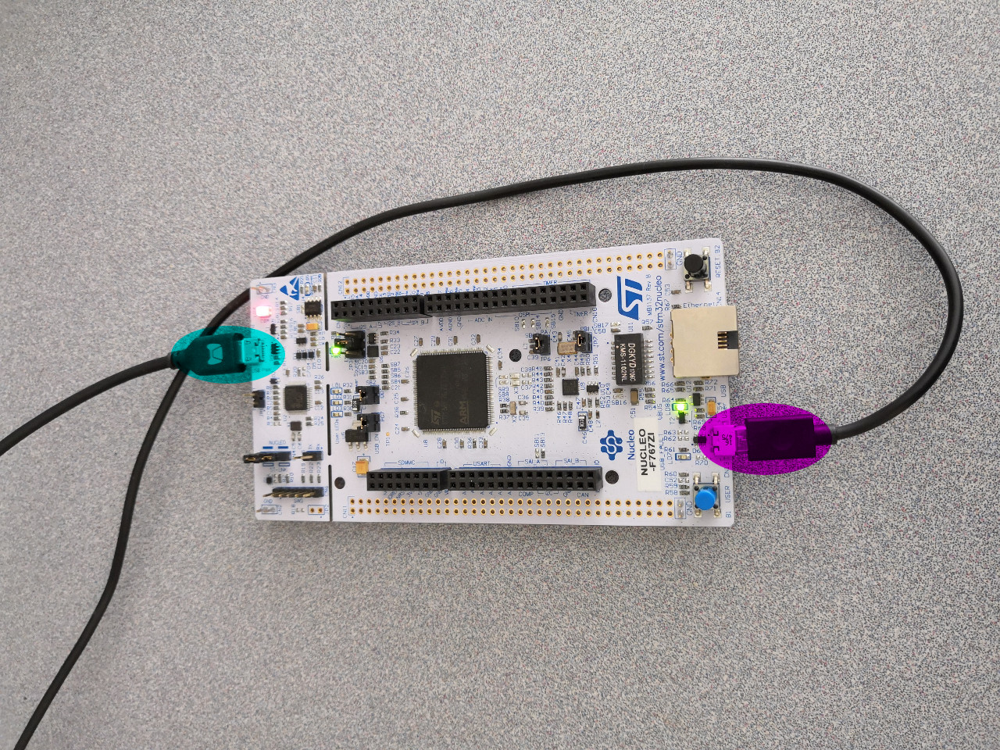

# 2.5 Test On Nucleo-144 STM32F767ZI

**Finally**, we come to test out some examples on board [Nucleo-144 STM32F767ZI](http://www.st.com/en/evaluation-tools/nucleo-f767zi.html).


## 2.5.1 Plug in Nucleo-144 STM32F767ZI

We first plug in the board [Nucleo-144 STM32F767ZI](http://www.st.com/en/evaluation-tools/nucleo-f767zi.html) as follows:



* On one side, plugging in the STLink USB port with the host computer is demonstrated by command **lsusb**.

```
$ lsusb
...
Bus 001 Device 005: ID 0483:374b STMicroelectronics ST-LINK/V2.1 (Nucleo-F103RB)
...
```

If we had [ST-Link](https://github.com/texane/stlink) successfully installed, we can also demonstrate its existance by command **st-info --probe**.

```
$ st-info --probe
Found 1 stlink programmers
 serial: 303636454646333333303336343334
openocd: "\x30\x36\x36\x45\x46\x46\x33\x33\x33\x30\x33\x36\x34\x33\x34"
  flash: 2097152 (pagesize: 2048)
   sram: 524288
 chipid: 0x0451
  descr: F76xxx device
```

* On the other side, plugging in the other USB port for [Nucleo-144 STM32F767ZI](http://www.st.com/en/evaluation-tools/nucleo-f767zi.html) will be demonstrated by our test code.


## 2.5.2 Create and Build Project

Similar to [previous section](../02_Programming_for_STM32/04_QEMU_Simulation.md), this time, we create a **Blinky** C/C++ project with board configuration **STM32F7xx** with Chip family **STM32F767xx**. And we can also have the project successfully built with **Release** configuration with the following output:

```
17:57:31 **** Build of configuration Release for project F767ZI_Blinky ****
make all 
Building file: ../system/src/stm32f7-hal/stm32f7xx_hal.c
Invoking: GNU ARM Cross C Compiler
arm-none-eabi-gcc -mcpu=cortex-m7 -mthumb -mfloat-abi=soft -Os -fmessage-length=0 -fsigned-char -ffunction-sections -fdata-sections -Wall -Wextra  -g -DOS_USE_SEMIHOSTING -DNDEBUG -DSTM32F767xx -DUSE_HAL_DRIVER -DHSE_VALUE=8000000 -I"../include" -I"../system/include" -I"../system/include/cmsis" -I"../system/include/stm32f7-hal" -std=gnu11 -Wno-bad-function-cast -Wno-conversion -Wno-sign-conversion -Wno-unused-parameter -Wno-sign-compare -Wno-missing-prototypes -Wno-missing-declarations -MMD -MP -MF"system/src/stm32f7-hal/stm32f7xx_hal.d" -MT"system/src/stm32f7-hal/stm32f7xx_hal.o" -c -o "system/src/stm32f7-hal/stm32f7xx_hal.o" "../system/src/stm32f7-hal/stm32f7xx_hal.c"
Finished building: ../system/src/stm32f7-hal/stm32f7xx_hal.c
 
Building file: ../system/src/stm32f7-hal/stm32f7xx_hal_cortex.c
Invoking: GNU ARM Cross C Compiler
arm-none-eabi-gcc -mcpu=cortex-m7 -mthumb -mfloat-abi=soft -Os -fmessage-length=0 -fsigned-char -ffunction-sections -fdata-sections -Wall -Wextra  -g -DOS_USE_SEMIHOSTING -DNDEBUG -DSTM32F767xx -DUSE_HAL_DRIVER -DHSE_VALUE=8000000 -I"../include" -I"../system/include" -I"../system/include/cmsis" -I"../system/include/stm32f7-hal" -std=gnu11 -Wno-bad-function-cast -Wno-conversion -Wno-sign-conversion -Wno-unused-parameter -Wno-sign-compare -Wno-missing-prototypes -Wno-missing-declarations -MMD -MP -MF"system/src/stm32f7-hal/stm32f7xx_hal_cortex.d" -MT"system/src/stm32f7-hal/stm32f7xx_hal_cortex.o" -c -o "system/src/stm32f7-hal/stm32f7xx_hal_cortex.o" "../system/src/stm32f7-hal/stm32f7xx_hal_cortex.c"
Finished building: ../system/src/stm32f7-hal/stm32f7xx_hal_cortex.c
 
Building file: ../system/src/stm32f7-hal/stm32f7xx_hal_crc_ex.c
Invoking: GNU ARM Cross C Compiler
arm-none-eabi-gcc -mcpu=cortex-m7 -mthumb -mfloat-abi=soft -Os -fmessage-length=0 -fsigned-char -ffunction-sections -fdata-sections -Wall -Wextra  -g -DOS_USE_SEMIHOSTING -DNDEBUG -DSTM32F767xx -DUSE_HAL_DRIVER -DHSE_VALUE=8000000 -I"../include" -I"../system/include" -I"../system/include/cmsis" -I"../system/include/stm32f7-hal" -std=gnu11 -Wno-bad-function-cast -Wno-conversion -Wno-sign-conversion -Wno-unused-parameter -Wno-sign-compare -Wno-missing-prototypes -Wno-missing-declarations -MMD -MP -MF"system/src/stm32f7-hal/stm32f7xx_hal_crc_ex.d" -MT"system/src/stm32f7-hal/stm32f7xx_hal_crc_ex.o" -c -o "system/src/stm32f7-hal/stm32f7xx_hal_crc_ex.o" "../system/src/stm32f7-hal/stm32f7xx_hal_crc_ex.c"
Finished building: ../system/src/stm32f7-hal/stm32f7xx_hal_crc_ex.c
 
Building file: ../system/src/stm32f7-hal/stm32f7xx_hal_dfsdm.c
Invoking: GNU ARM Cross C Compiler
arm-none-eabi-gcc -mcpu=cortex-m7 -mthumb -mfloat-abi=soft -Os -fmessage-length=0 -fsigned-char -ffunction-sections -fdata-sections -Wall -Wextra  -g -DOS_USE_SEMIHOSTING -DNDEBUG -DSTM32F767xx -DUSE_HAL_DRIVER -DHSE_VALUE=8000000 -I"../include" -I"../system/include" -I"../system/include/cmsis" -I"../system/include/stm32f7-hal" -std=gnu11 -Wno-bad-function-cast -Wno-conversion -Wno-sign-conversion -Wno-unused-parameter -Wno-sign-compare -Wno-missing-prototypes -Wno-missing-declarations -MMD -MP -MF"system/src/stm32f7-hal/stm32f7xx_hal_dfsdm.d" -MT"system/src/stm32f7-hal/stm32f7xx_hal_dfsdm.o" -c -o "system/src/stm32f7-hal/stm32f7xx_hal_dfsdm.o" "../system/src/stm32f7-hal/stm32f7xx_hal_dfsdm.c"
Finished building: ../system/src/stm32f7-hal/stm32f7xx_hal_dfsdm.c
 
Building file: ../system/src/stm32f7-hal/stm32f7xx_hal_flash.c
Invoking: GNU ARM Cross C Compiler
arm-none-eabi-gcc -mcpu=cortex-m7 -mthumb -mfloat-abi=soft -Os -fmessage-length=0 -fsigned-char -ffunction-sections -fdata-sections -Wall -Wextra  -g -DOS_USE_SEMIHOSTING -DNDEBUG -DSTM32F767xx -DUSE_HAL_DRIVER -DHSE_VALUE=8000000 -I"../include" -I"../system/include" -I"../system/include/cmsis" -I"../system/include/stm32f7-hal" -std=gnu11 -Wno-bad-function-cast -Wno-conversion -Wno-sign-conversion -Wno-unused-parameter -Wno-sign-compare -Wno-missing-prototypes -Wno-missing-declarations -MMD -MP -MF"system/src/stm32f7-hal/stm32f7xx_hal_flash.d" -MT"system/src/stm32f7-hal/stm32f7xx_hal_flash.o" -c -o "system/src/stm32f7-hal/stm32f7xx_hal_flash.o" "../system/src/stm32f7-hal/stm32f7xx_hal_flash.c"
Finished building: ../system/src/stm32f7-hal/stm32f7xx_hal_flash.c
 
Building file: ../system/src/stm32f7-hal/stm32f7xx_hal_gpio.c
Invoking: GNU ARM Cross C Compiler
arm-none-eabi-gcc -mcpu=cortex-m7 -mthumb -mfloat-abi=soft -Os -fmessage-length=0 -fsigned-char -ffunction-sections -fdata-sections -Wall -Wextra  -g -DOS_USE_SEMIHOSTING -DNDEBUG -DSTM32F767xx -DUSE_HAL_DRIVER -DHSE_VALUE=8000000 -I"../include" -I"../system/include" -I"../system/include/cmsis" -I"../system/include/stm32f7-hal" -std=gnu11 -Wno-bad-function-cast -Wno-conversion -Wno-sign-conversion -Wno-unused-parameter -Wno-sign-compare -Wno-missing-prototypes -Wno-missing-declarations -MMD -MP -MF"system/src/stm32f7-hal/stm32f7xx_hal_gpio.d" -MT"system/src/stm32f7-hal/stm32f7xx_hal_gpio.o" -c -o "system/src/stm32f7-hal/stm32f7xx_hal_gpio.o" "../system/src/stm32f7-hal/stm32f7xx_hal_gpio.c"
Finished building: ../system/src/stm32f7-hal/stm32f7xx_hal_gpio.c
 
Building file: ../system/src/stm32f7-hal/stm32f7xx_hal_iwdg.c
Invoking: GNU ARM Cross C Compiler
arm-none-eabi-gcc -mcpu=cortex-m7 -mthumb -mfloat-abi=soft -Os -fmessage-length=0 -fsigned-char -ffunction-sections -fdata-sections -Wall -Wextra  -g -DOS_USE_SEMIHOSTING -DNDEBUG -DSTM32F767xx -DUSE_HAL_DRIVER -DHSE_VALUE=8000000 -I"../include" -I"../system/include" -I"../system/include/cmsis" -I"../system/include/stm32f7-hal" -std=gnu11 -Wno-bad-function-cast -Wno-conversion -Wno-sign-conversion -Wno-unused-parameter -Wno-sign-compare -Wno-missing-prototypes -Wno-missing-declarations -MMD -MP -MF"system/src/stm32f7-hal/stm32f7xx_hal_iwdg.d" -MT"system/src/stm32f7-hal/stm32f7xx_hal_iwdg.o" -c -o "system/src/stm32f7-hal/stm32f7xx_hal_iwdg.o" "../system/src/stm32f7-hal/stm32f7xx_hal_iwdg.c"
Finished building: ../system/src/stm32f7-hal/stm32f7xx_hal_iwdg.c
 
Building file: ../system/src/stm32f7-hal/stm32f7xx_hal_jpeg.c
Invoking: GNU ARM Cross C Compiler
arm-none-eabi-gcc -mcpu=cortex-m7 -mthumb -mfloat-abi=soft -Os -fmessage-length=0 -fsigned-char -ffunction-sections -fdata-sections -Wall -Wextra  -g -DOS_USE_SEMIHOSTING -DNDEBUG -DSTM32F767xx -DUSE_HAL_DRIVER -DHSE_VALUE=8000000 -I"../include" -I"../system/include" -I"../system/include/cmsis" -I"../system/include/stm32f7-hal" -std=gnu11 -Wno-bad-function-cast -Wno-conversion -Wno-sign-conversion -Wno-unused-parameter -Wno-sign-compare -Wno-missing-prototypes -Wno-missing-declarations -MMD -MP -MF"system/src/stm32f7-hal/stm32f7xx_hal_jpeg.d" -MT"system/src/stm32f7-hal/stm32f7xx_hal_jpeg.o" -c -o "system/src/stm32f7-hal/stm32f7xx_hal_jpeg.o" "../system/src/stm32f7-hal/stm32f7xx_hal_jpeg.c"
Finished building: ../system/src/stm32f7-hal/stm32f7xx_hal_jpeg.c
 
Building file: ../system/src/stm32f7-hal/stm32f7xx_hal_mdios.c
Invoking: GNU ARM Cross C Compiler
arm-none-eabi-gcc -mcpu=cortex-m7 -mthumb -mfloat-abi=soft -Os -fmessage-length=0 -fsigned-char -ffunction-sections -fdata-sections -Wall -Wextra  -g -DOS_USE_SEMIHOSTING -DNDEBUG -DSTM32F767xx -DUSE_HAL_DRIVER -DHSE_VALUE=8000000 -I"../include" -I"../system/include" -I"../system/include/cmsis" -I"../system/include/stm32f7-hal" -std=gnu11 -Wno-bad-function-cast -Wno-conversion -Wno-sign-conversion -Wno-unused-parameter -Wno-sign-compare -Wno-missing-prototypes -Wno-missing-declarations -MMD -MP -MF"system/src/stm32f7-hal/stm32f7xx_hal_mdios.d" -MT"system/src/stm32f7-hal/stm32f7xx_hal_mdios.o" -c -o "system/src/stm32f7-hal/stm32f7xx_hal_mdios.o" "../system/src/stm32f7-hal/stm32f7xx_hal_mdios.c"
Finished building: ../system/src/stm32f7-hal/stm32f7xx_hal_mdios.c
 
Building file: ../system/src/stm32f7-hal/stm32f7xx_hal_pwr.c
Invoking: GNU ARM Cross C Compiler
arm-none-eabi-gcc -mcpu=cortex-m7 -mthumb -mfloat-abi=soft -Os -fmessage-length=0 -fsigned-char -ffunction-sections -fdata-sections -Wall -Wextra  -g -DOS_USE_SEMIHOSTING -DNDEBUG -DSTM32F767xx -DUSE_HAL_DRIVER -DHSE_VALUE=8000000 -I"../include" -I"../system/include" -I"../system/include/cmsis" -I"../system/include/stm32f7-hal" -std=gnu11 -Wno-bad-function-cast -Wno-conversion -Wno-sign-conversion -Wno-unused-parameter -Wno-sign-compare -Wno-missing-prototypes -Wno-missing-declarations -MMD -MP -MF"system/src/stm32f7-hal/stm32f7xx_hal_pwr.d" -MT"system/src/stm32f7-hal/stm32f7xx_hal_pwr.o" -c -o "system/src/stm32f7-hal/stm32f7xx_hal_pwr.o" "../system/src/stm32f7-hal/stm32f7xx_hal_pwr.c"
Finished building: ../system/src/stm32f7-hal/stm32f7xx_hal_pwr.c
 
Building file: ../system/src/stm32f7-hal/stm32f7xx_hal_pwr_ex.c
Invoking: GNU ARM Cross C Compiler
arm-none-eabi-gcc -mcpu=cortex-m7 -mthumb -mfloat-abi=soft -Os -fmessage-length=0 -fsigned-char -ffunction-sections -fdata-sections -Wall -Wextra  -g -DOS_USE_SEMIHOSTING -DNDEBUG -DSTM32F767xx -DUSE_HAL_DRIVER -DHSE_VALUE=8000000 -I"../include" -I"../system/include" -I"../system/include/cmsis" -I"../system/include/stm32f7-hal" -std=gnu11 -Wno-bad-function-cast -Wno-conversion -Wno-sign-conversion -Wno-unused-parameter -Wno-sign-compare -Wno-missing-prototypes -Wno-missing-declarations -MMD -MP -MF"system/src/stm32f7-hal/stm32f7xx_hal_pwr_ex.d" -MT"system/src/stm32f7-hal/stm32f7xx_hal_pwr_ex.o" -c -o "system/src/stm32f7-hal/stm32f7xx_hal_pwr_ex.o" "../system/src/stm32f7-hal/stm32f7xx_hal_pwr_ex.c"
Finished building: ../system/src/stm32f7-hal/stm32f7xx_hal_pwr_ex.c
 
Building file: ../system/src/stm32f7-hal/stm32f7xx_hal_rcc.c
Invoking: GNU ARM Cross C Compiler
arm-none-eabi-gcc -mcpu=cortex-m7 -mthumb -mfloat-abi=soft -Os -fmessage-length=0 -fsigned-char -ffunction-sections -fdata-sections -Wall -Wextra  -g -DOS_USE_SEMIHOSTING -DNDEBUG -DSTM32F767xx -DUSE_HAL_DRIVER -DHSE_VALUE=8000000 -I"../include" -I"../system/include" -I"../system/include/cmsis" -I"../system/include/stm32f7-hal" -std=gnu11 -Wno-bad-function-cast -Wno-conversion -Wno-sign-conversion -Wno-unused-parameter -Wno-sign-compare -Wno-missing-prototypes -Wno-missing-declarations -MMD -MP -MF"system/src/stm32f7-hal/stm32f7xx_hal_rcc.d" -MT"system/src/stm32f7-hal/stm32f7xx_hal_rcc.o" -c -o "system/src/stm32f7-hal/stm32f7xx_hal_rcc.o" "../system/src/stm32f7-hal/stm32f7xx_hal_rcc.c"
Finished building: ../system/src/stm32f7-hal/stm32f7xx_hal_rcc.c
 
Building file: ../system/src/stm32f7-hal/stm32f7xx_hal_rcc_ex.c
Invoking: GNU ARM Cross C Compiler
arm-none-eabi-gcc -mcpu=cortex-m7 -mthumb -mfloat-abi=soft -Os -fmessage-length=0 -fsigned-char -ffunction-sections -fdata-sections -Wall -Wextra  -g -DOS_USE_SEMIHOSTING -DNDEBUG -DSTM32F767xx -DUSE_HAL_DRIVER -DHSE_VALUE=8000000 -I"../include" -I"../system/include" -I"../system/include/cmsis" -I"../system/include/stm32f7-hal" -std=gnu11 -Wno-bad-function-cast -Wno-conversion -Wno-sign-conversion -Wno-unused-parameter -Wno-sign-compare -Wno-missing-prototypes -Wno-missing-declarations -MMD -MP -MF"system/src/stm32f7-hal/stm32f7xx_hal_rcc_ex.d" -MT"system/src/stm32f7-hal/stm32f7xx_hal_rcc_ex.o" -c -o "system/src/stm32f7-hal/stm32f7xx_hal_rcc_ex.o" "../system/src/stm32f7-hal/stm32f7xx_hal_rcc_ex.c"
Finished building: ../system/src/stm32f7-hal/stm32f7xx_hal_rcc_ex.c
 
Building file: ../system/src/stm32f7-hal/stm32f7xx_hal_smartcard_ex.c
Invoking: GNU ARM Cross C Compiler
arm-none-eabi-gcc -mcpu=cortex-m7 -mthumb -mfloat-abi=soft -Os -fmessage-length=0 -fsigned-char -ffunction-sections -fdata-sections -Wall -Wextra  -g -DOS_USE_SEMIHOSTING -DNDEBUG -DSTM32F767xx -DUSE_HAL_DRIVER -DHSE_VALUE=8000000 -I"../include" -I"../system/include" -I"../system/include/cmsis" -I"../system/include/stm32f7-hal" -std=gnu11 -Wno-bad-function-cast -Wno-conversion -Wno-sign-conversion -Wno-unused-parameter -Wno-sign-compare -Wno-missing-prototypes -Wno-missing-declarations -MMD -MP -MF"system/src/stm32f7-hal/stm32f7xx_hal_smartcard_ex.d" -MT"system/src/stm32f7-hal/stm32f7xx_hal_smartcard_ex.o" -c -o "system/src/stm32f7-hal/stm32f7xx_hal_smartcard_ex.o" "../system/src/stm32f7-hal/stm32f7xx_hal_smartcard_ex.c"
Finished building: ../system/src/stm32f7-hal/stm32f7xx_hal_smartcard_ex.c
 
Building file: ../system/src/newlib/_cxx.cpp
Invoking: GNU ARM Cross C++ Compiler
arm-none-eabi-g++ -mcpu=cortex-m7 -mthumb -mfloat-abi=soft -Os -fmessage-length=0 -fsigned-char -ffunction-sections -fdata-sections -Wall -Wextra  -g -DOS_USE_SEMIHOSTING -DNDEBUG -DSTM32F767xx -DUSE_HAL_DRIVER -DHSE_VALUE=8000000 -I"../include" -I"../system/include" -I"../system/include/cmsis" -I"../system/include/stm32f7-hal" -std=gnu++11 -fabi-version=0 -fno-exceptions -fno-rtti -fno-use-cxa-atexit -fno-threadsafe-statics -MMD -MP -MF"system/src/newlib/_cxx.d" -MT"system/src/newlib/_cxx.o" -c -o "system/src/newlib/_cxx.o" "../system/src/newlib/_cxx.cpp"
Finished building: ../system/src/newlib/_cxx.cpp
 
Building file: ../system/src/newlib/_exit.c
Invoking: GNU ARM Cross C Compiler
arm-none-eabi-gcc -mcpu=cortex-m7 -mthumb -mfloat-abi=soft -Os -fmessage-length=0 -fsigned-char -ffunction-sections -fdata-sections -Wall -Wextra  -g -DOS_USE_SEMIHOSTING -DNDEBUG -DSTM32F767xx -DUSE_HAL_DRIVER -DHSE_VALUE=8000000 -I"../include" -I"../system/include" -I"../system/include/cmsis" -I"../system/include/stm32f7-hal" -std=gnu11 -MMD -MP -MF"system/src/newlib/_exit.d" -MT"system/src/newlib/_exit.o" -c -o "system/src/newlib/_exit.o" "../system/src/newlib/_exit.c"
Finished building: ../system/src/newlib/_exit.c
 
Building file: ../system/src/newlib/_sbrk.c
Invoking: GNU ARM Cross C Compiler
arm-none-eabi-gcc -mcpu=cortex-m7 -mthumb -mfloat-abi=soft -Os -fmessage-length=0 -fsigned-char -ffunction-sections -fdata-sections -Wall -Wextra  -g -DOS_USE_SEMIHOSTING -DNDEBUG -DSTM32F767xx -DUSE_HAL_DRIVER -DHSE_VALUE=8000000 -I"../include" -I"../system/include" -I"../system/include/cmsis" -I"../system/include/stm32f7-hal" -std=gnu11 -MMD -MP -MF"system/src/newlib/_sbrk.d" -MT"system/src/newlib/_sbrk.o" -c -o "system/src/newlib/_sbrk.o" "../system/src/newlib/_sbrk.c"
Finished building: ../system/src/newlib/_sbrk.c
 
Building file: ../system/src/newlib/_startup.c
Invoking: GNU ARM Cross C Compiler
arm-none-eabi-gcc -mcpu=cortex-m7 -mthumb -mfloat-abi=soft -Os -fmessage-length=0 -fsigned-char -ffunction-sections -fdata-sections -Wall -Wextra  -g -DOS_USE_SEMIHOSTING -DNDEBUG -DSTM32F767xx -DUSE_HAL_DRIVER -DHSE_VALUE=8000000 -DOS_INCLUDE_STARTUP_INIT_MULTIPLE_RAM_SECTIONS -I"../include" -I"../system/include" -I"../system/include/cmsis" -I"../system/include/stm32f7-hal" -std=gnu11 -MMD -MP -MF"system/src/newlib/_startup.d" -MT"system/src/newlib/_startup.d" -c -o "system/src/newlib/_startup.o" "../system/src/newlib/_startup.c"
Finished building: ../system/src/newlib/_startup.c
 
Building file: ../system/src/newlib/_syscalls.c
Invoking: GNU ARM Cross C Compiler
arm-none-eabi-gcc -mcpu=cortex-m7 -mthumb -mfloat-abi=soft -Os -fmessage-length=0 -fsigned-char -ffunction-sections -fdata-sections -Wall -Wextra  -g -DOS_USE_SEMIHOSTING -DNDEBUG -DSTM32F767xx -DUSE_HAL_DRIVER -DHSE_VALUE=8000000 -I"../include" -I"../system/include" -I"../system/include/cmsis" -I"../system/include/stm32f7-hal" -std=gnu11 -MMD -MP -MF"system/src/newlib/_syscalls.d" -MT"system/src/newlib/_syscalls.o" -c -o "system/src/newlib/_syscalls.o" "../system/src/newlib/_syscalls.c"
Finished building: ../system/src/newlib/_syscalls.c
 
Building file: ../system/src/newlib/assert.c
Invoking: GNU ARM Cross C Compiler
arm-none-eabi-gcc -mcpu=cortex-m7 -mthumb -mfloat-abi=soft -Os -fmessage-length=0 -fsigned-char -ffunction-sections -fdata-sections -Wall -Wextra  -g -DOS_USE_SEMIHOSTING -DNDEBUG -DSTM32F767xx -DUSE_HAL_DRIVER -DHSE_VALUE=8000000 -I"../include" -I"../system/include" -I"../system/include/cmsis" -I"../system/include/stm32f7-hal" -std=gnu11 -MMD -MP -MF"system/src/newlib/assert.d" -MT"system/src/newlib/assert.o" -c -o "system/src/newlib/assert.o" "../system/src/newlib/assert.c"
Finished building: ../system/src/newlib/assert.c
 
Building file: ../system/src/diag/Trace.c
Invoking: GNU ARM Cross C Compiler
arm-none-eabi-gcc -mcpu=cortex-m7 -mthumb -mfloat-abi=soft -Os -fmessage-length=0 -fsigned-char -ffunction-sections -fdata-sections -Wall -Wextra  -g -DOS_USE_SEMIHOSTING -DNDEBUG -DSTM32F767xx -DUSE_HAL_DRIVER -DHSE_VALUE=8000000 -I"../include" -I"../system/include" -I"../system/include/cmsis" -I"../system/include/stm32f7-hal" -std=gnu11 -MMD -MP -MF"system/src/diag/Trace.d" -MT"system/src/diag/Trace.o" -c -o "system/src/diag/Trace.o" "../system/src/diag/Trace.c"
Finished building: ../system/src/diag/Trace.c
 
Building file: ../system/src/diag/trace_impl.c
Invoking: GNU ARM Cross C Compiler
arm-none-eabi-gcc -mcpu=cortex-m7 -mthumb -mfloat-abi=soft -Os -fmessage-length=0 -fsigned-char -ffunction-sections -fdata-sections -Wall -Wextra  -g -DOS_USE_SEMIHOSTING -DNDEBUG -DSTM32F767xx -DUSE_HAL_DRIVER -DHSE_VALUE=8000000 -I"../include" -I"../system/include" -I"../system/include/cmsis" -I"../system/include/stm32f7-hal" -std=gnu11 -MMD -MP -MF"system/src/diag/trace_impl.d" -MT"system/src/diag/trace_impl.o" -c -o "system/src/diag/trace_impl.o" "../system/src/diag/trace_impl.c"
Finished building: ../system/src/diag/trace_impl.c
 
Building file: ../system/src/cortexm/_initialize_hardware.c
Invoking: GNU ARM Cross C Compiler
arm-none-eabi-gcc -mcpu=cortex-m7 -mthumb -mfloat-abi=soft -Os -fmessage-length=0 -fsigned-char -ffunction-sections -fdata-sections -Wall -Wextra  -g -DOS_USE_SEMIHOSTING -DNDEBUG -DSTM32F767xx -DUSE_HAL_DRIVER -DHSE_VALUE=8000000 -I"../include" -I"../system/include" -I"../system/include/cmsis" -I"../system/include/stm32f7-hal" -std=gnu11 -MMD -MP -MF"system/src/cortexm/_initialize_hardware.d" -MT"system/src/cortexm/_initialize_hardware.o" -c -o "system/src/cortexm/_initialize_hardware.o" "../system/src/cortexm/_initialize_hardware.c"
Finished building: ../system/src/cortexm/_initialize_hardware.c
 
Building file: ../system/src/cortexm/_reset_hardware.c
Invoking: GNU ARM Cross C Compiler
arm-none-eabi-gcc -mcpu=cortex-m7 -mthumb -mfloat-abi=soft -Os -fmessage-length=0 -fsigned-char -ffunction-sections -fdata-sections -Wall -Wextra  -g -DOS_USE_SEMIHOSTING -DNDEBUG -DSTM32F767xx -DUSE_HAL_DRIVER -DHSE_VALUE=8000000 -I"../include" -I"../system/include" -I"../system/include/cmsis" -I"../system/include/stm32f7-hal" -std=gnu11 -MMD -MP -MF"system/src/cortexm/_reset_hardware.d" -MT"system/src/cortexm/_reset_hardware.o" -c -o "system/src/cortexm/_reset_hardware.o" "../system/src/cortexm/_reset_hardware.c"
Finished building: ../system/src/cortexm/_reset_hardware.c
 
Building file: ../system/src/cortexm/exception_handlers.c
Invoking: GNU ARM Cross C Compiler
arm-none-eabi-gcc -mcpu=cortex-m7 -mthumb -mfloat-abi=soft -Os -fmessage-length=0 -fsigned-char -ffunction-sections -fdata-sections -Wall -Wextra  -g -DOS_USE_SEMIHOSTING -DNDEBUG -DSTM32F767xx -DUSE_HAL_DRIVER -DHSE_VALUE=8000000 -I"../include" -I"../system/include" -I"../system/include/cmsis" -I"../system/include/stm32f7-hal" -std=gnu11 -MMD -MP -MF"system/src/cortexm/exception_handlers.d" -MT"system/src/cortexm/exception_handlers.o" -c -o "system/src/cortexm/exception_handlers.o" "../system/src/cortexm/exception_handlers.c"
Finished building: ../system/src/cortexm/exception_handlers.c
 
Building file: ../system/src/cmsis/system_stm32f7xx.c
Invoking: GNU ARM Cross C Compiler
arm-none-eabi-gcc -mcpu=cortex-m7 -mthumb -mfloat-abi=soft -Os -fmessage-length=0 -fsigned-char -ffunction-sections -fdata-sections -Wall -Wextra  -g -DOS_USE_SEMIHOSTING -DNDEBUG -DSTM32F767xx -DUSE_HAL_DRIVER -DHSE_VALUE=8000000 -I"../include" -I"../system/include" -I"../system/include/cmsis" -I"../system/include/stm32f7-hal" -std=gnu11 -MMD -MP -MF"system/src/cmsis/system_stm32f7xx.d" -MT"system/src/cmsis/system_stm32f7xx.o" -c -o "system/src/cmsis/system_stm32f7xx.o" "../system/src/cmsis/system_stm32f7xx.c"
Finished building: ../system/src/cmsis/system_stm32f7xx.c
 
Building file: ../system/src/cmsis/vectors_stm32f767xx.c
Invoking: GNU ARM Cross C Compiler
arm-none-eabi-gcc -mcpu=cortex-m7 -mthumb -mfloat-abi=soft -Os -fmessage-length=0 -fsigned-char -ffunction-sections -fdata-sections -Wall -Wextra  -g -DOS_USE_SEMIHOSTING -DNDEBUG -DSTM32F767xx -DUSE_HAL_DRIVER -DHSE_VALUE=8000000 -I"../include" -I"../system/include" -I"../system/include/cmsis" -I"../system/include/stm32f7-hal" -std=gnu11 -MMD -MP -MF"system/src/cmsis/vectors_stm32f767xx.d" -MT"system/src/cmsis/vectors_stm32f767xx.o" -c -o "system/src/cmsis/vectors_stm32f767xx.o" "../system/src/cmsis/vectors_stm32f767xx.c"
Finished building: ../system/src/cmsis/vectors_stm32f767xx.c
 
Building file: ../src/BlinkLed.cpp
Invoking: GNU ARM Cross C++ Compiler
arm-none-eabi-g++ -mcpu=cortex-m7 -mthumb -mfloat-abi=soft -Os -fmessage-length=0 -fsigned-char -ffunction-sections -fdata-sections -Wall -Wextra  -g -DOS_USE_SEMIHOSTING -DNDEBUG -DSTM32F767xx -DUSE_HAL_DRIVER -DHSE_VALUE=8000000 -I"../include" -I"../system/include" -I"../system/include/cmsis" -I"../system/include/stm32f7-hal" -std=gnu++11 -fabi-version=0 -fno-exceptions -fno-rtti -fno-use-cxa-atexit -fno-threadsafe-statics -MMD -MP -MF"src/BlinkLed.d" -MT"src/BlinkLed.o" -c -o "src/BlinkLed.o" "../src/BlinkLed.cpp"
Finished building: ../src/BlinkLed.cpp
 
Building file: ../src/Timer.cpp
Invoking: GNU ARM Cross C++ Compiler
arm-none-eabi-g++ -mcpu=cortex-m7 -mthumb -mfloat-abi=soft -Os -fmessage-length=0 -fsigned-char -ffunction-sections -fdata-sections -Wall -Wextra  -g -DOS_USE_SEMIHOSTING -DNDEBUG -DSTM32F767xx -DUSE_HAL_DRIVER -DHSE_VALUE=8000000 -I"../include" -I"../system/include" -I"../system/include/cmsis" -I"../system/include/stm32f7-hal" -std=gnu++11 -fabi-version=0 -fno-exceptions -fno-rtti -fno-use-cxa-atexit -fno-threadsafe-statics -MMD -MP -MF"src/Timer.d" -MT"src/Timer.o" -c -o "src/Timer.o" "../src/Timer.cpp"
Finished building: ../src/Timer.cpp
 
Building file: ../src/_initialize_hardware.c
Invoking: GNU ARM Cross C Compiler
arm-none-eabi-gcc -mcpu=cortex-m7 -mthumb -mfloat-abi=soft -Os -fmessage-length=0 -fsigned-char -ffunction-sections -fdata-sections -Wall -Wextra  -g -DOS_USE_SEMIHOSTING -DNDEBUG -DSTM32F767xx -DUSE_HAL_DRIVER -DHSE_VALUE=8000000 -I"../include" -I"../system/include" -I"../system/include/cmsis" -I"../system/include/stm32f7-hal" -std=gnu11 -MMD -MP -MF"src/_initialize_hardware.d" -MT"src/_initialize_hardware.o" -c -o "src/_initialize_hardware.o" "../src/_initialize_hardware.c"
../src/_initialize_hardware.c: In function 'SystemClock_Config':
../src/_initialize_hardware.c:150:2: warning: #warning "Please check if the SystemClock_Config() settings match your board!" [-Wcpp]
 #warning "Please check if the SystemClock_Config() settings match your board!"
  ^~~~~~~
Finished building: ../src/_initialize_hardware.c
 
Building file: ../src/_write.c
Invoking: GNU ARM Cross C Compiler
arm-none-eabi-gcc -mcpu=cortex-m7 -mthumb -mfloat-abi=soft -Os -fmessage-length=0 -fsigned-char -ffunction-sections -fdata-sections -Wall -Wextra  -g -DOS_USE_SEMIHOSTING -DNDEBUG -DSTM32F767xx -DUSE_HAL_DRIVER -DHSE_VALUE=8000000 -I"../include" -I"../system/include" -I"../system/include/cmsis" -I"../system/include/stm32f7-hal" -std=gnu11 -MMD -MP -MF"src/_write.d" -MT"src/_write.o" -c -o "src/_write.o" "../src/_write.c"
Finished building: ../src/_write.c
 
Building file: ../src/main.cpp
Invoking: GNU ARM Cross C++ Compiler
arm-none-eabi-g++ -mcpu=cortex-m7 -mthumb -mfloat-abi=soft -Os -fmessage-length=0 -fsigned-char -ffunction-sections -fdata-sections -Wall -Wextra  -g -DOS_USE_SEMIHOSTING -DNDEBUG -DSTM32F767xx -DUSE_HAL_DRIVER -DHSE_VALUE=8000000 -I"../include" -I"../system/include" -I"../system/include/cmsis" -I"../system/include/stm32f7-hal" -std=gnu++11 -fabi-version=0 -fno-exceptions -fno-rtti -fno-use-cxa-atexit -fno-threadsafe-statics -MMD -MP -MF"src/main.d" -MT"src/main.o" -c -o "src/main.o" "../src/main.cpp"
../src/main.cpp:113:2: warning: #warning "Unknown board, assume PA5, active high." [-Wcpp]
 #warning "Unknown board, assume PA5, active high."
  ^~~~~~~
Finished building: ../src/main.cpp
 
Building file: ../src/stm32f7xx_hal_msp.c
Invoking: GNU ARM Cross C Compiler
arm-none-eabi-gcc -mcpu=cortex-m7 -mthumb -mfloat-abi=soft -Os -fmessage-length=0 -fsigned-char -ffunction-sections -fdata-sections -Wall -Wextra  -g -DOS_USE_SEMIHOSTING -DNDEBUG -DSTM32F767xx -DUSE_HAL_DRIVER -DHSE_VALUE=8000000 -I"../include" -I"../system/include" -I"../system/include/cmsis" -I"../system/include/stm32f7-hal" -std=gnu11 -Wno-missing-prototypes -Wno-missing-declarations -MMD -MP -MF"src/stm32f7xx_hal_msp.d" -MT"src/stm32f7xx_hal_msp.d" -c -o "src/stm32f7xx_hal_msp.o" "../src/stm32f7xx_hal_msp.c"
Finished building: ../src/stm32f7xx_hal_msp.c
 
Building target: F767ZI_Blinky.elf
Invoking: GNU ARM Cross C++ Linker
arm-none-eabi-g++ -mcpu=cortex-m7 -mthumb -mfloat-abi=soft -Os -fmessage-length=0 -fsigned-char -ffunction-sections -fdata-sections -Wall -Wextra  -g -T mem.ld -T libs.ld -T sections.ld -nostartfiles -Xlinker --gc-sections -L"../ldscripts" -Wl,-Map,"F767ZI_Blinky.map" --specs=nano.specs -o "F767ZI_Blinky.elf"  ./system/src/stm32f7-hal/stm32f7xx_hal.o ./system/src/stm32f7-hal/stm32f7xx_hal_cortex.o ./system/src/stm32f7-hal/stm32f7xx_hal_crc_ex.o ./system/src/stm32f7-hal/stm32f7xx_hal_dfsdm.o ./system/src/stm32f7-hal/stm32f7xx_hal_flash.o ./system/src/stm32f7-hal/stm32f7xx_hal_gpio.o ./system/src/stm32f7-hal/stm32f7xx_hal_iwdg.o ./system/src/stm32f7-hal/stm32f7xx_hal_jpeg.o ./system/src/stm32f7-hal/stm32f7xx_hal_mdios.o ./system/src/stm32f7-hal/stm32f7xx_hal_pwr.o ./system/src/stm32f7-hal/stm32f7xx_hal_pwr_ex.o ./system/src/stm32f7-hal/stm32f7xx_hal_rcc.o ./system/src/stm32f7-hal/stm32f7xx_hal_rcc_ex.o ./system/src/stm32f7-hal/stm32f7xx_hal_smartcard_ex.o  ./system/src/newlib/_cxx.o ./system/src/newlib/_exit.o ./system/src/newlib/_sbrk.o ./system/src/newlib/_startup.o ./system/src/newlib/_syscalls.o ./system/src/newlib/assert.o  ./system/src/diag/Trace.o ./system/src/diag/trace_impl.o  ./system/src/cortexm/_initialize_hardware.o ./system/src/cortexm/_reset_hardware.o ./system/src/cortexm/exception_handlers.o  ./system/src/cmsis/system_stm32f7xx.o ./system/src/cmsis/vectors_stm32f767xx.o  ./src/BlinkLed.o ./src/Timer.o ./src/_initialize_hardware.o ./src/_write.o ./src/main.o ./src/stm32f7xx_hal_msp.o   
Finished building target: F767ZI_Blinky.elf
 
Invoking: GNU ARM Cross Create Flash Image
arm-none-eabi-objcopy -O ihex "F767ZI_Blinky.elf"  "F767ZI_Blinky.hex"
Finished building: F767ZI_Blinky.hex
 
Invoking: GNU ARM Cross Print Size
arm-none-eabi-size --format=berkeley "F767ZI_Blinky.elf"
   text	   data	    bss	    dec	    hex	filename
   8591	    512	    588	   9691	   25db	F767ZI_Blinky.elf
Finished building: F767ZI_Blinky.siz
 

17:57:34 Build Finished (took 3s.375ms)
```


## 2.5.3 Flash Built .elf onto Nucleo-144 STM32F767ZI

As we mentioned in [previous section](../02_Programming_for_STM32/04_QEMU_Simulation.md), the **NEWEST** [GNU MCU Eclipse QEMU](https://gnu-mcu-eclipse.github.io/qemu/) does **NOT** support [Nucleo-144 STM32F767ZI](http://www.st.com/en/evaluation-tools/nucleo-f767zi.html) yet. Therefore, we are going to flash **F767ZI_Blinky.elf** directly onto [Nucleo-144 STM32F767ZI](http://www.st.com/en/evaluation-tools/nucleo-f767zi.html) for our test.

We **first** have a look at how many **ST** tools have been installed:
```
$ ls -ls /usr/local/bin/st*
 16 -rwxr-xr-x 1 root root  14312 May 18 23:16 /usr/local/bin/st-flash
 12 -rwxr-xr-x 1 root root  10216 May 18 23:16 /usr/local/bin/st-info
104 -rwxr-xr-x 1 root root 104960 May 18 23:16 /usr/local/bin/stlink-gui
 52 -rwxr-xr-x 1 root root  51544 May 18 23:16 /usr/local/bin/st-util
```

And, let's try out each **ST** tool one by one.

### st-info

Tested in the above already, and its **ONLY** usage is:
```
$ st-info --probe
Found 1 stlink programmers
 serial: 303636454646333333303336343334
openocd: "\x30\x36\x36\x45\x46\x46\x33\x33\x33\x30\x33\x36\x34\x33\x34"
  flash: 2097152 (pagesize: 2048)
   sram: 524288
 chipid: 0x0451
  descr: F76xxx device
```

### st-util

Let's have a look at how can we use **st-util** by **help**.
```
$ st-util --help
st-util - usage:

  -h, --help            Print this help
  -V, --version         Print the version
  -vXX, --verbose=XX    Specify a specific verbosity level (0..99)
  -v, --verbose         Specify generally verbose logging
  -s X, --stlink_version=X
                        Choose what version of stlink to use, (defaults to 2)
  -1, --stlinkv1        Force stlink version 1
  -p 4242, --listen_port=1234
                        Set the gdb server listen port. (default port: 4242)
  -m, --multi
                        Set gdb server to extended mode.
                        st-util will continue listening for connections after disconnect.
  -n, --no-reset
                        Do not reset board on connection.
  --semihosting
                        Enable semihosting support.
  --serial <serial>
                        Use a specific serial number.

The STLINKv2 device to use can be specified in the environment
variable STLINK_DEVICE on the format <USB_BUS>:<USB_ADDR>.
```

Then, we print out the version as:
```
$ st-util -V
st-util: invalid option -- 'V'
st-util 1.4.0-37-g065a475
2018-05-20T22:42:43 INFO common.c: Loading device parameters....
2018-05-20T22:42:43 INFO common.c: Device connected is: F76xxx device, id 0x10016451
2018-05-20T22:42:43 INFO common.c: SRAM size: 0x80000 bytes (512 KiB), Flash: 0x200000 bytes (2048 KiB) in pages of 2048 bytes
2018-05-20T22:42:43 INFO gdb-server.c: Chip ID is 00000451, Core ID is  5ba02477.
2018-05-20T22:42:43 INFO gdb-server.c: Chip clidr: 09000003, I-Cache: off, D-Cache: off
2018-05-20T22:42:43 INFO gdb-server.c:  cache: LoUU: 1, LoC: 1, LoUIS: 0
2018-05-20T22:42:43 INFO gdb-server.c:  cache: ctr: 8303c003, DminLine: 32 bytes, IminLine: 32 bytes
2018-05-20T22:42:43 INFO gdb-server.c: D-Cache L0: 2018-05-20T22:42:43 INFO gdb-server.c: f00fe019 LineSize: 8, ways: 4, sets: 128 (width: 12)
2018-05-20T22:42:43 INFO gdb-server.c: I-Cache L0: 2018-05-20T22:42:43 INFO gdb-server.c: f01fe009 LineSize: 8, ways: 2, sets: 256 (width: 13)
2018-05-20T22:42:43 INFO gdb-server.c: Listening at *:4242...

```


### stlink-gui

Command **stlink-gui** will pop up a dialog automatically:


Then we click on the **Connect** button:


After a while, we can see the data in tab **Device Memory** after the device is connected:


Then we click on **No file** and load the built **.elf** file **F767ZI_Blinky.elf**:


After loading **F767ZI_Blinky.elf**, we can see the data in tab **F767ZI_Blinky.elf**:


And now it's the time to flash the loaded file **F767ZI_Blinky.elf** down to board [Nucleo-144 STM32F767ZI](http://www.st.com/en/evaluation-tools/nucleo-f767zi.html):


Flashing


We also notice the situation change from within **bash** as follows:

```
$ Gtk-Message: 18:40:02.578: GtkDialog mapped without a transient parent. This is discouraged.
Flash page at addr: 0x08040000 erasedEraseFlash - Sector:0x5 Size:0x40000 
enabling 32-bit flash writes
size: 32768
size: 32768
size: 32768
size: 32768
size: 32768
size: 32768
size: 32768
size: 32768
size: 27496
```


After finishing flashing the data onto the device, we can even **Export device memory** into a particular file. Here, we can see, the data is successfully exported.


Finally, we can disconnect the device after flashing.


<span style="color:red">Clearly, **stlink-gui** is a **GUI** application to flash built **.elf** down to the device (a development board with some particular MCU).</span>


### st-flash

Unlike **stlink-gui**, **st-flash** is a command line application to flash built **.bin** down to the embedded device. But, we need firstly build **.bin** file out from **.elf** file. Here, we need to use the command **arm-none-eabi-objcopy**.

```
$ arm-none-eabi-objcopy -S -O binary F767ZI_Blinky.elf F767ZI_Blinky.bin
```

Afterwards, we investigate how to use **st-flash** :

```
$ st-flash --help
invalid command line
stlinkv1 command line: ./st-flash [--debug] [--reset] [--format <format>] [--flash=<fsize>] {read|write} /dev/sgX <path> <addr> <size>
stlinkv1 command line: ./st-flash [--debug] /dev/sgX erase
stlinkv2 command line: ./st-flash [--debug] [--reset] [--serial <serial>] [--format <format>] [--flash=<fsize>] {read|write} <path> <addr> <size>
stlinkv2 command line: ./st-flash [--debug] [--serial <serial>] erase
stlinkv2 command line: ./st-flash [--debug] [--serial <serial>] reset
                       Use hex format for addr, <serial> and <size>.
                       fsize: Use decimal, octal or hex by prefix 0xXXX for hex, optionally followed by k=KB, or m=MB (eg. --flash=128k)
                       Format may be 'binary' (default) or 'ihex', although <addr> must be specified for binary format only.
                       ./st-flash [--version]
```


We can also refer to [st-flash documentation](https://github.com/texane/stlink/blob/master/doc/man/st-flash.md) for more details.

##### Usage 1: Flash .bin file to device

```
$ st-flash write firmware.bin 0x8000000
```

##### Usage 2: Read .bin from device (4096 bytes)

```
$ st-flash read firmware.bin 0x8000000 4096
```

##### Erase firmware from device

```
$ st-flash erase
```


#### Step 1: Erase Memory on Device

```
$ st-flash erase
st-flash 1.4.0-37-g065a475
2018-05-21T02:40:59 INFO common.c: Loading device parameters....
2018-05-21T02:40:59 INFO common.c: Device connected is: F76xxx device, id 0x10016451
2018-05-21T02:40:59 INFO common.c: SRAM size: 0x80000 bytes (512 KiB), Flash: 0x200000 bytes (2048 KiB) in pages of 2048 bytes
Mass erasing..............
```

#### Step 2: Flash F767ZI_Blinky.bin to [Nucleo-144 STM32F767ZI](http://www.st.com/en/evaluation-tools/nucleo-f767zi.html)

```
$ st-flash write F767ZI_Blinky.bin 0x8000000
st-flash 1.4.0-37-g065a475
2018-05-21T02:47:51 INFO common.c: Loading device parameters....
2018-05-21T02:47:51 INFO common.c: Device connected is: F76xxx device, id 0x10016451
2018-05-21T02:47:51 INFO common.c: SRAM size: 0x80000 bytes (512 KiB), Flash: 0x200000 bytes (2048 KiB) in pages of 2048 bytes
2018-05-21T02:47:51 INFO common.c: Attempting to write 9108 (0x2394) bytes to stm32 address: 134217728 (0x8000000)
Flash page at addr: 0x08000000 erased
2018-05-21T02:47:51 INFO common.c: Finished erasing 1 pages of 32768 (0x8000) bytes
2018-05-21T02:47:51 INFO common.c: Starting Flash write for F2/F4/L4
2018-05-21T02:47:51 INFO flash_loader.c: Successfully loaded flash loader in sram
enabling 32-bit flash writes
size: 9108
2018-05-21T02:47:51 INFO common.c: Starting verification of write complete
2018-05-21T02:47:51 INFO common.c: Flash written and verified! jolly good!
```


## 2.5.4 On-board Debugging

According to [ST-Link Tutorial](https://github.com/texane/stlink/blob/master/doc/tutorial.md), we need to run commands both **st-util** and **arm-none-eabi-gdb** at the same time.

### st-util

#### Tab 1:
```
$ st-util --semihosting
st-util 1.4.0-37-g065a475
2018-05-21T13:30:18 INFO common.c: Loading device parameters....
2018-05-21T13:30:18 INFO common.c: Device connected is: F76xxx device, id 0x10016451
2018-05-21T13:30:18 INFO common.c: SRAM size: 0x80000 bytes (512 KiB), Flash: 0x200000 bytes (2048 KiB) in pages of 2048 bytes
2018-05-21T13:30:18 INFO gdb-server.c: Chip ID is 00000451, Core ID is  5ba02477.
2018-05-21T13:30:18 INFO gdb-server.c: Chip clidr: 09000003, I-Cache: off, D-Cache: off
2018-05-21T13:30:18 INFO gdb-server.c:  cache: LoUU: 1, LoC: 1, LoUIS: 0
2018-05-21T13:30:18 INFO gdb-server.c:  cache: ctr: 8303c003, DminLine: 32 bytes, IminLine: 32 bytes
2018-05-21T13:30:18 INFO gdb-server.c: D-Cache L0: 2018-05-21T13:30:18 INFO gdb-server.c: f00fe019 LineSize: 8, ways: 4, sets: 128 (width: 12)
2018-05-21T13:30:18 INFO gdb-server.c: I-Cache L0: 2018-05-21T13:30:18 INFO gdb-server.c: f01fe009 LineSize: 8, ways: 2, sets: 256 (width: 13)
2018-05-21T13:30:18 INFO gdb-server.c: Listening at *:4242...
```

### arm-none-eabi-gdb

#### Tab 2:
```
$ arm-none-eabi-gdb F767ZI_Blinky.elf 
GNU gdb (GNU Tools for Arm Embedded Processors 7-2017-q4-major) 8.0.50.20171128-git
Copyright (C) 2017 Free Software Foundation, Inc.
License GPLv3+: GNU GPL version 3 or later <http://gnu.org/licenses/gpl.html>
This is free software: you are free to change and redistribute it.
There is NO WARRANTY, to the extent permitted by law.  Type "show copying"
and "show warranty" for details.
This GDB was configured as "--host=x86_64-linux-gnu --target=arm-none-eabi".
Type "show configuration" for configuration details.
For bug reporting instructions, please see:
<http://www.gnu.org/software/gdb/bugs/>.
Find the GDB manual and other documentation resources online at:
<http://www.gnu.org/software/gdb/documentation/>.
For help, type "help".
Type "apropos word" to search for commands related to "word"...
Reading symbols from F767ZI_Blinky.elf...done.
```

We then listen to the port **4242** specified in **st-util**.
#### Tab 2:
```
(gdb) target extended localhost:4242
Remote debugging using localhost:4242
Reset_Handler () at ../system/src/cortexm/exception_handlers.c:53
53      {
```

Meanwhile, **Tab 1** change a bit accordingly.
#### Tab 1: 
```
2018-05-21T13:32:42 INFO gdb-server.c: Found 8 hw breakpoint registers
2018-05-21T13:32:42 INFO gdb-server.c: GDB connected.
```

Then, we load the data from **gdb**.
#### Tab 2:
```
(gdb) load
Loading section .isr_vector, size 0x458 lma 0x8000000
Loading section .inits, size 0x2c lma 0x8000458
Loading section .text, size 0x30e6 lma 0x8000490
Loading section .data, size 0x1dc lma 0x8003578
Start address 0x80001f8, load size 14150
Transfer rate: 10 KB/sec, 3537 bytes/write.
```

**Tab 1** change accordingly at the same time.
#### Tab 1: 
```
2018-05-21T13:48:22 INFO common.c: Attempting to write 32768 (0x8000) bytes to stm32 address: 134217728 (0x8000000)
Flash page at addr: 0x08000000 erased
2018-05-21T13:48:22 INFO common.c: Finished erasing 1 pages of 32768 (0x8000) bytes
2018-05-21T13:48:22 INFO common.c: Starting Flash write for F2/F4/L4
2018-05-21T13:48:22 INFO flash_loader.c: Successfully loaded flash loader in sram
enabling 32-bit flash writes
size: 32768
2018-05-21T13:48:22 INFO common.c: Starting verification of write complete
2018-05-21T13:48:23 INFO common.c: Flash written and verified! jolly good!
```

Afterward, we **continue** in **gdb**.
#### Tab 2:
```
(gdb) continue
Continuing.
```

**Tab 1** change accordingly.
```
semihosting: unsupported call 0x15
main(argc=1, argv=[""]);
Hello ARM World!
semihosting: unsupported call 0xc
semihosting: unsupported call 0x9
System clock: 192000000 Hz
Second 1
Second 2
Second 3
Second 4
Second 5
Second 6
semihosting: unsupported call 0x18
```


And, finally, let's have a look at the video of the Blinky example on our **STM32F767ZI** board.
[](https://youtu.be/tHQDhOTX3M4)
